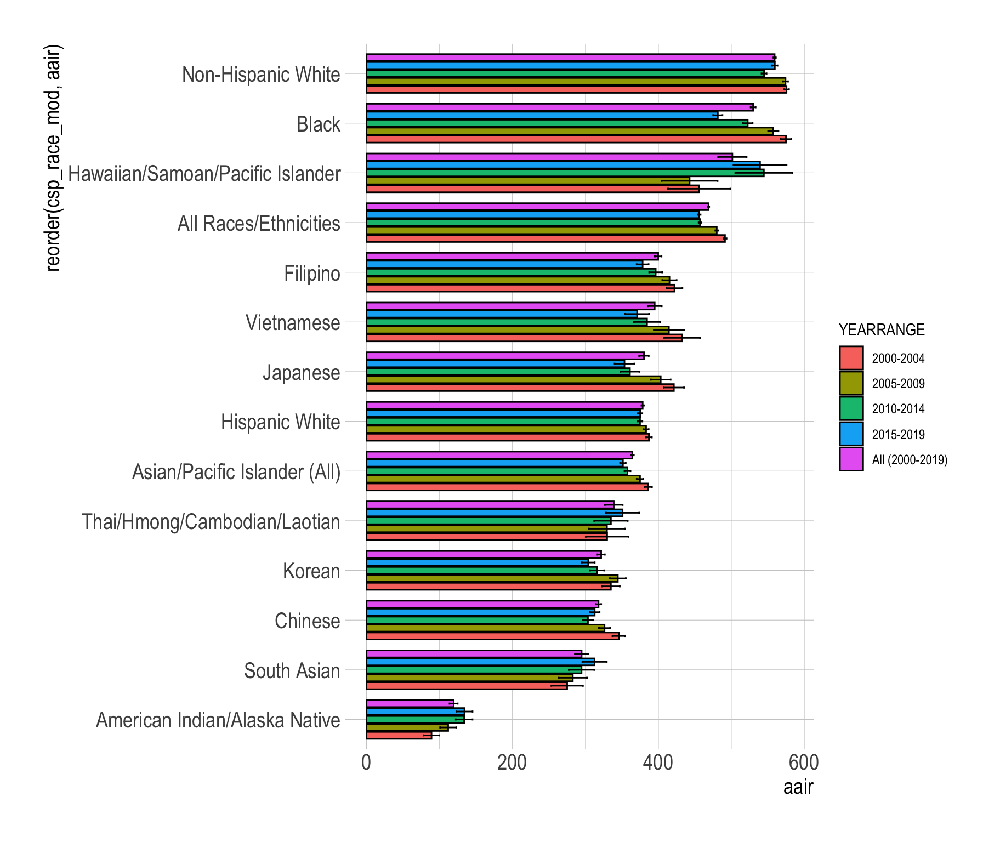
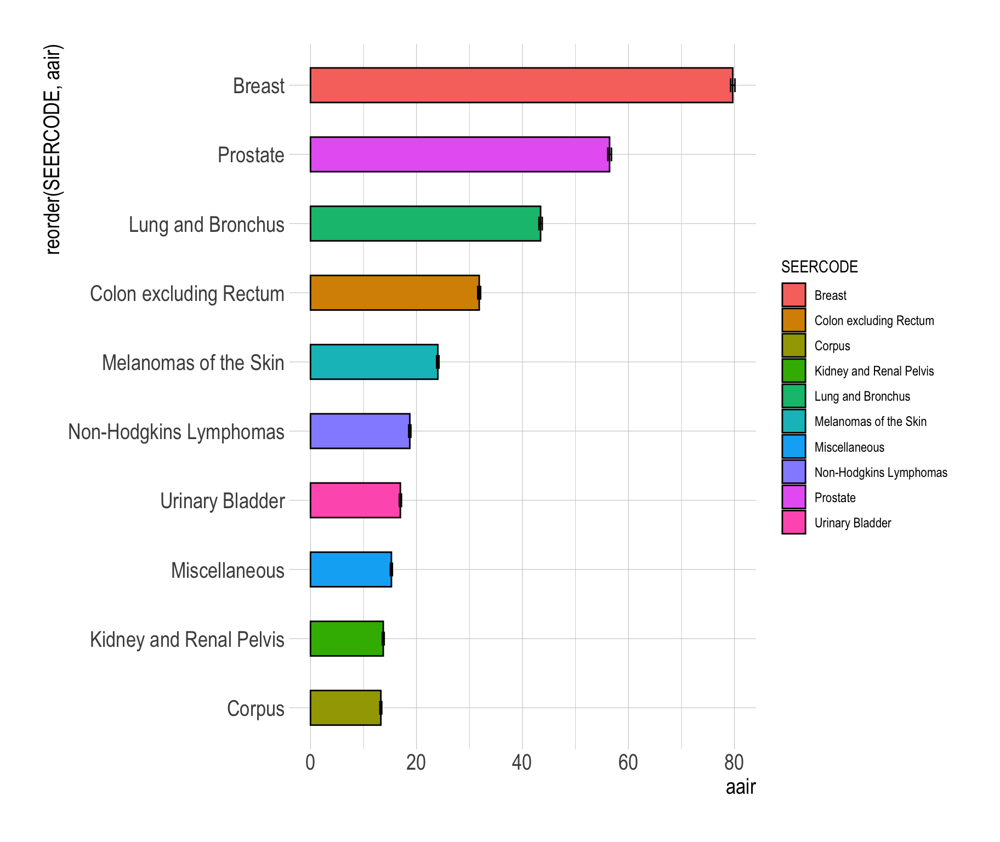
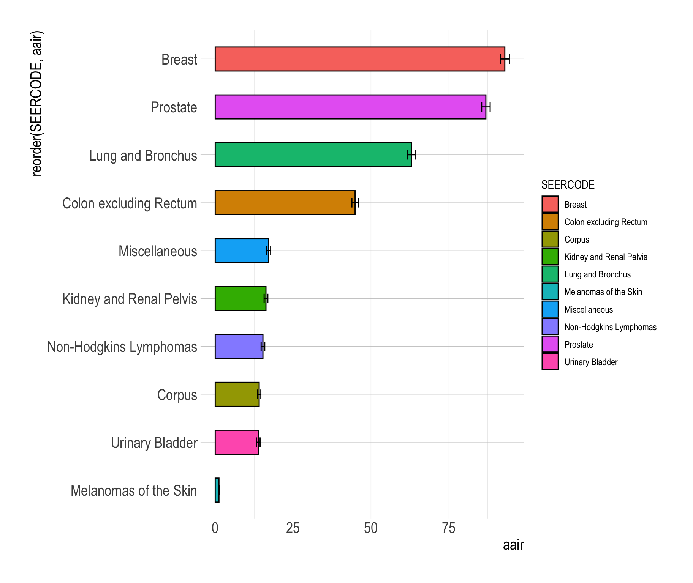
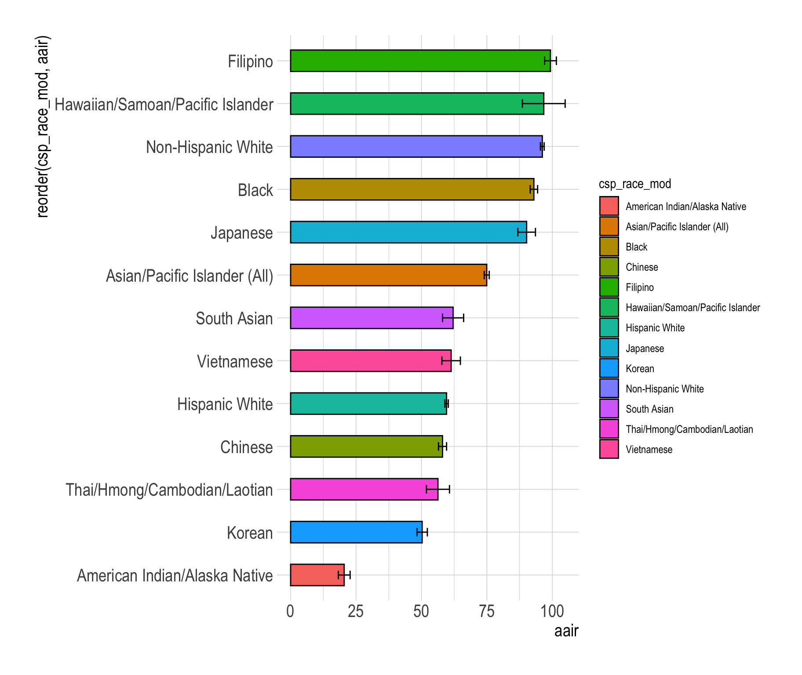
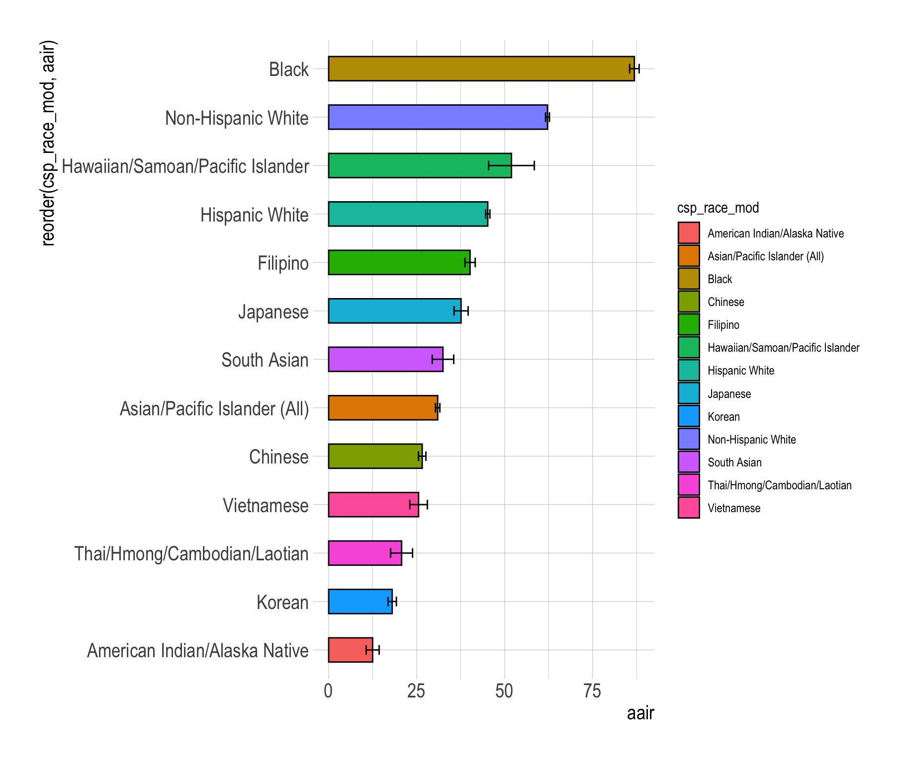
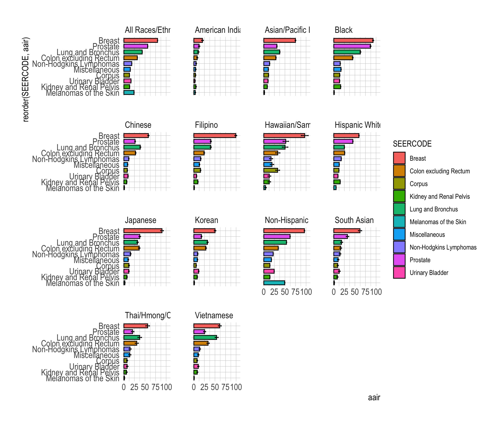
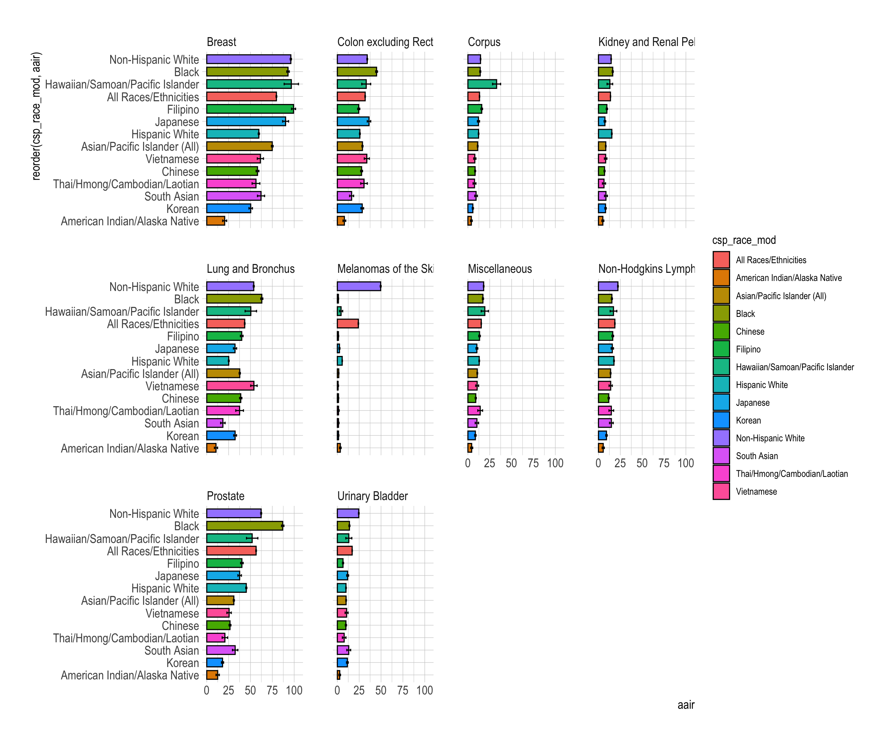

<br>
<br>
<br>

<!--Initialize-->


# Grouped barplot

## Races X years



# Single barplot

## Top N sites, all races



## Top N sites, selected race


## Races for a specific cancer site: Breast


## Races for a specific cancer site: Prostate



# Faceted barplots

## Top N sites, facet races


## Top N sites, facet by site



# Line plots

## Races over time

```{=html}
<div id="htmlwidget-f727fa0da73fa6d523e1" style="width:912px;height:768px;" class="plotly html-widget"></div>
<script type="application/json" data-for="htmlwidget-f727fa0da73fa6d523e1">{"x":{"data":[{"x":[1,2,3,4],"y":[491.29,480.01,457.04,455.97],"text":["Cancer site:  All Cancer Sites<br>Race/ethnicity:  All Races/Ethnicities<br>Cases: 199943<br> Age-adjusted IR (95% CI): 491.29 (489.13, 493.46)","Cancer site:  All Cancer Sites<br>Race/ethnicity:  All Races/Ethnicities<br>Cases: 213701<br> Age-adjusted IR (95% CI): 480.01 (477.96, 482.06)","Cancer site:  All Cancer Sites<br>Race/ethnicity:  All Races/Ethnicities<br>Cases: 220116<br> Age-adjusted IR (95% CI): 457.04 (455.1, 458.98)","Cancer site:  All Cancer Sites<br>Race/ethnicity:  All Races/Ethnicities<br>Cases: 232380<br> Age-adjusted IR (95% CI): 455.97 (454.06, 457.87)"],"type":"scatter","mode":"lines+markers","line":{"width":1.88976377952756,"color":"rgba(248,118,109,1)","dash":"solid"},"hoveron":"points","name":"All Races/Ethnicities","legendgroup":"All Races/Ethnicities","showlegend":true,"xaxis":"x","yaxis":"y","hoverinfo":"text","marker":{"autocolorscale":false,"color":"rgba(248,118,109,1)","opacity":0.5,"size":5.66929133858268,"symbol":"circle","line":{"width":1.88976377952756,"color":"rgba(248,118,109,1)"}},"frame":null},{"x":[1,2,3,4],"y":[89.04,111.88,133.76,134.19],"text":["Cancer site:  All Cancer Sites<br>Race/ethnicity:  American Indian/Alaska Native<br>Cases: 297<br> Age-adjusted IR (95% CI): 89.04 (78.17, 99.9)","Cancer site:  All Cancer Sites<br>Race/ethnicity:  American Indian/Alaska Native<br>Cases: 441<br> Age-adjusted IR (95% CI): 111.88 (100.75, 123)","Cancer site:  All Cancer Sites<br>Race/ethnicity:  American Indian/Alaska Native<br>Cases: 582<br> Age-adjusted IR (95% CI): 133.76 (122.25, 145.27)","Cancer site:  All Cancer Sites<br>Race/ethnicity:  American Indian/Alaska Native<br>Cases: 632<br> Age-adjusted IR (95% CI): 134.19 (123.08, 145.31)"],"type":"scatter","mode":"lines+markers","line":{"width":1.88976377952756,"color":"rgba(227,137,0,1)","dash":"solid"},"hoveron":"points","name":"American Indian/Alaska Native","legendgroup":"American Indian/Alaska Native","showlegend":true,"xaxis":"x","yaxis":"y","hoverinfo":"text","marker":{"autocolorscale":false,"color":"rgba(227,137,0,1)","opacity":0.5,"size":5.66929133858268,"symbol":"circle","line":{"width":1.88976377952756,"color":"rgba(227,137,0,1)"}},"frame":null},{"x":[1,2,3,4],"y":[386.07,374.8,357.64,351.4],"text":["Cancer site:  All Cancer Sites<br>Race/ethnicity:  Asian/Pacific Islander (All)<br>Cases: 22514<br> Age-adjusted IR (95% CI): 386.07 (380.96, 391.18)","Cancer site:  All Cancer Sites<br>Race/ethnicity:  Asian/Pacific Islander (All)<br>Cases: 26568<br> Age-adjusted IR (95% CI): 374.8 (370.24, 379.36)","Cancer site:  All Cancer Sites<br>Race/ethnicity:  Asian/Pacific Islander (All)<br>Cases: 29757<br> Age-adjusted IR (95% CI): 357.64 (353.51, 361.78)","Cancer site:  All Cancer Sites<br>Race/ethnicity:  Asian/Pacific Islander (All)<br>Cases: 33261<br> Age-adjusted IR (95% CI): 351.4 (347.53, 355.27)"],"type":"scatter","mode":"lines+markers","line":{"width":1.88976377952756,"color":"rgba(196,154,0,1)","dash":"solid"},"hoveron":"points","name":"Asian/Pacific Islander (All)","legendgroup":"Asian/Pacific Islander (All)","showlegend":true,"xaxis":"x","yaxis":"y","hoverinfo":"text","marker":{"autocolorscale":false,"color":"rgba(196,154,0,1)","opacity":0.5,"size":5.66929133858268,"symbol":"circle","line":{"width":1.88976377952756,"color":"rgba(196,154,0,1)"}},"frame":null},{"x":[1,2,3,4],"y":[574.84,557.49,522.46,481.46],"text":["Cancer site:  All Cancer Sites<br>Race/ethnicity:  Black<br>Cases: 23259<br> Age-adjusted IR (95% CI): 574.84 (567.36, 582.32)","Cancer site:  All Cancer Sites<br>Race/ethnicity:  Black<br>Cases: 24187<br> Age-adjusted IR (95% CI): 557.49 (550.37, 564.62)","Cancer site:  All Cancer Sites<br>Race/ethnicity:  Black<br>Cases: 24211<br> Age-adjusted IR (95% CI): 522.46 (515.75, 529.17)","Cancer site:  All Cancer Sites<br>Race/ethnicity:  Black<br>Cases: 23139<br> Age-adjusted IR (95% CI): 481.46 (475.05, 487.87)"],"type":"scatter","mode":"lines+markers","line":{"width":1.88976377952756,"color":"rgba(153,168,0,1)","dash":"solid"},"hoveron":"points","name":"Black","legendgroup":"Black","showlegend":true,"xaxis":"x","yaxis":"y","hoverinfo":"text","marker":{"autocolorscale":false,"color":"rgba(153,168,0,1)","opacity":0.5,"size":5.66929133858268,"symbol":"circle","line":{"width":1.88976377952756,"color":"rgba(153,168,0,1)"}},"frame":null},{"x":[1,2,3,4],"y":[345.77,326.19,303.45,312.71],"text":["Cancer site:  All Cancer Sites<br>Race/ethnicity:  Chinese<br>Cases: 6064<br> Age-adjusted IR (95% CI): 345.77 (337, 354.55)","Cancer site:  All Cancer Sites<br>Race/ethnicity:  Chinese<br>Cases: 7052<br> Age-adjusted IR (95% CI): 326.19 (318.51, 333.88)","Cancer site:  All Cancer Sites<br>Race/ethnicity:  Chinese<br>Cases: 7755<br> Age-adjusted IR (95% CI): 303.45 (296.54, 310.36)","Cancer site:  All Cancer Sites<br>Race/ethnicity:  Chinese<br>Cases: 9043<br> Age-adjusted IR (95% CI): 312.71 (306.02, 319.41)"],"type":"scatter","mode":"lines+markers","line":{"width":1.88976377952756,"color":"rgba(83,180,0,1)","dash":"solid"},"hoveron":"points","name":"Chinese","legendgroup":"Chinese","showlegend":true,"xaxis":"x","yaxis":"y","hoverinfo":"text","marker":{"autocolorscale":false,"color":"rgba(83,180,0,1)","opacity":0.5,"size":5.66929133858268,"symbol":"circle","line":{"width":1.88976377952756,"color":"rgba(83,180,0,1)"}},"frame":null},{"x":[1,2,3,4],"y":[421.99,415.19,396.32,378.39],"text":["Cancer site:  All Cancer Sites<br>Race/ethnicity:  Filipino<br>Cases: 5905<br> Age-adjusted IR (95% CI): 421.99 (411.01, 432.97)","Cancer site:  All Cancer Sites<br>Race/ethnicity:  Filipino<br>Cases: 7099<br> Age-adjusted IR (95% CI): 415.19 (405.31, 425.06)","Cancer site:  All Cancer Sites<br>Race/ethnicity:  Filipino<br>Cases: 8008<br> Age-adjusted IR (95% CI): 396.32 (387.39, 405.25)","Cancer site:  All Cancer Sites<br>Race/ethnicity:  Filipino<br>Cases: 8692<br> Age-adjusted IR (95% CI): 378.39 (370.16, 386.63)"],"type":"scatter","mode":"lines+markers","line":{"width":1.88976377952756,"color":"rgba(0,188,86,1)","dash":"solid"},"hoveron":"points","name":"Filipino","legendgroup":"Filipino","showlegend":true,"xaxis":"x","yaxis":"y","hoverinfo":"text","marker":{"autocolorscale":false,"color":"rgba(0,188,86,1)","opacity":0.5,"size":5.66929133858268,"symbol":"circle","line":{"width":1.88976377952756,"color":"rgba(0,188,86,1)"}},"frame":null},{"x":[1,2,3,4],"y":[455.96,442.8,544.59,539.32],"text":["Cancer site:  All Cancer Sites<br>Race/ethnicity:  Hawaiian/Samoan/Pacific Islander<br>Cases: 507<br> Age-adjusted IR (95% CI): 455.96 (413.22, 498.71)","Cancer site:  All Cancer Sites<br>Race/ethnicity:  Hawaiian/Samoan/Pacific Islander<br>Cases: 575<br> Age-adjusted IR (95% CI): 442.8 (404.41, 481.18)","Cancer site:  All Cancer Sites<br>Race/ethnicity:  Hawaiian/Samoan/Pacific Islander<br>Cases: 817<br> Age-adjusted IR (95% CI): 544.59 (505.41, 583.77)","Cancer site:  All Cancer Sites<br>Race/ethnicity:  Hawaiian/Samoan/Pacific Islander<br>Cases: 912<br> Age-adjusted IR (95% CI): 539.32 (502.87, 575.76)"],"type":"scatter","mode":"lines+markers","line":{"width":1.88976377952756,"color":"rgba(0,192,148,1)","dash":"solid"},"hoveron":"points","name":"Hawaiian/Samoan/Pacific Islander","legendgroup":"Hawaiian/Samoan/Pacific Islander","showlegend":true,"xaxis":"x","yaxis":"y","hoverinfo":"text","marker":{"autocolorscale":false,"color":"rgba(0,192,148,1)","opacity":0.5,"size":5.66929133858268,"symbol":"circle","line":{"width":1.88976377952756,"color":"rgba(0,192,148,1)"}},"frame":null},{"x":[1,2,3,4],"y":[387.01,383.11,374.82,374.97],"text":["Cancer site:  All Cancer Sites<br>Race/ethnicity:  Hispanic White<br>Cases: 41199<br> Age-adjusted IR (95% CI): 387.01 (382.97, 391.06)","Cancer site:  All Cancer Sites<br>Race/ethnicity:  Hispanic White<br>Cases: 49591<br> Age-adjusted IR (95% CI): 383.11 (379.51, 386.71)","Cancer site:  All Cancer Sites<br>Race/ethnicity:  Hispanic White<br>Cases: 57235<br> Age-adjusted IR (95% CI): 374.82 (371.57, 378.07)","Cancer site:  All Cancer Sites<br>Race/ethnicity:  Hispanic White<br>Cases: 64978<br> Age-adjusted IR (95% CI): 374.97 (371.93, 378.01)"],"type":"scatter","mode":"lines+markers","line":{"width":1.88976377952756,"color":"rgba(0,191,196,1)","dash":"solid"},"hoveron":"points","name":"Hispanic White","legendgroup":"Hispanic White","showlegend":true,"xaxis":"x","yaxis":"y","hoverinfo":"text","marker":{"autocolorscale":false,"color":"rgba(0,191,196,1)","opacity":0.5,"size":5.66929133858268,"symbol":"circle","line":{"width":1.88976377952756,"color":"rgba(0,191,196,1)"}},"frame":null},{"x":[1,2,3,4],"y":[421.23,403.22,360.98,353.51],"text":["Cancer site:  All Cancer Sites<br>Race/ethnicity:  Japanese<br>Cases: 3621<br> Age-adjusted IR (95% CI): 421.23 (407.23, 435.22)","Cancer site:  All Cancer Sites<br>Race/ethnicity:  Japanese<br>Cases: 3615<br> Age-adjusted IR (95% CI): 403.22 (389.63, 416.82)","Cancer site:  All Cancer Sites<br>Race/ethnicity:  Japanese<br>Cases: 3387<br> Age-adjusted IR (95% CI): 360.98 (347.98, 373.97)","Cancer site:  All Cancer Sites<br>Race/ethnicity:  Japanese<br>Cases: 3188<br> Age-adjusted IR (95% CI): 353.51 (339.93, 367.08)"],"type":"scatter","mode":"lines+markers","line":{"width":1.88976377952756,"color":"rgba(0,182,235,1)","dash":"solid"},"hoveron":"points","name":"Japanese","legendgroup":"Japanese","showlegend":true,"xaxis":"x","yaxis":"y","hoverinfo":"text","marker":{"autocolorscale":false,"color":"rgba(0,182,235,1)","opacity":0.5,"size":5.66929133858268,"symbol":"circle","line":{"width":1.88976377952756,"color":"rgba(0,182,235,1)"}},"frame":null},{"x":[1,2,3,4],"y":[334.9,344.41,316,303.85],"text":["Cancer site:  All Cancer Sites<br>Race/ethnicity:  Korean<br>Cases: 3051<br> Age-adjusted IR (95% CI): 334.9 (322.71, 347.09)","Cancer site:  All Cancer Sites<br>Race/ethnicity:  Korean<br>Cases: 3881<br> Age-adjusted IR (95% CI): 344.41 (333.42, 355.4)","Cancer site:  All Cancer Sites<br>Race/ethnicity:  Korean<br>Cases: 4183<br> Age-adjusted IR (95% CI): 316 (306.28, 325.72)","Cancer site:  All Cancer Sites<br>Race/ethnicity:  Korean<br>Cases: 4638<br> Age-adjusted IR (95% CI): 303.85 (294.94, 312.75)"],"type":"scatter","mode":"lines+markers","line":{"width":1.88976377952756,"color":"rgba(6,164,255,1)","dash":"solid"},"hoveron":"points","name":"Korean","legendgroup":"Korean","showlegend":true,"xaxis":"x","yaxis":"y","hoverinfo":"text","marker":{"autocolorscale":false,"color":"rgba(6,164,255,1)","opacity":0.5,"size":5.66929133858268,"symbol":"circle","line":{"width":1.88976377952756,"color":"rgba(6,164,255,1)"}},"frame":null},{"x":[1,2,3,4],"y":[575.64,574.28,544.8,559.62],"text":["Cancer site:  All Cancer Sites<br>Race/ethnicity:  Non-Hispanic White<br>Cases: 110954<br> Age-adjusted IR (95% CI): 575.64 (572.22, 579.05)","Cancer site:  All Cancer Sites<br>Race/ethnicity:  Non-Hispanic White<br>Cases: 110308<br> Age-adjusted IR (95% CI): 574.28 (570.83, 577.73)","Cancer site:  All Cancer Sites<br>Race/ethnicity:  Non-Hispanic White<br>Cases: 103457<br> Age-adjusted IR (95% CI): 544.8 (541.36, 548.25)","Cancer site:  All Cancer Sites<br>Race/ethnicity:  Non-Hispanic White<br>Cases: 101234<br> Age-adjusted IR (95% CI): 559.62 (555.92, 563.31)"],"type":"scatter","mode":"lines+markers","line":{"width":1.88976377952756,"color":"rgba(165,138,255,1)","dash":"solid"},"hoveron":"points","name":"Non-Hispanic White","legendgroup":"Non-Hispanic White","showlegend":true,"xaxis":"x","yaxis":"y","hoverinfo":"text","marker":{"autocolorscale":false,"color":"rgba(165,138,255,1)","opacity":0.5,"size":5.66929133858268,"symbol":"circle","line":{"width":1.88976377952756,"color":"rgba(165,138,255,1)"}},"frame":null},{"x":[1,2,3,4],"y":[274.95,282.7,294.69,312.54],"text":["Cancer site:  All Cancer Sites<br>Race/ethnicity:  South Asian<br>Cases: 773<br> Age-adjusted IR (95% CI): 274.95 (253.28, 296.63)","Cancer site:  All Cancer Sites<br>Race/ethnicity:  South Asian<br>Cases: 982<br> Age-adjusted IR (95% CI): 282.7 (263.29, 302.11)","Cancer site:  All Cancer Sites<br>Race/ethnicity:  South Asian<br>Cases: 1270<br> Age-adjusted IR (95% CI): 294.69 (277.19, 312.19)","Cancer site:  All Cancer Sites<br>Race/ethnicity:  South Asian<br>Cases: 1546<br> Age-adjusted IR (95% CI): 312.54 (295.83, 329.26)"],"type":"scatter","mode":"lines+markers","line":{"width":1.88976377952756,"color":"rgba(223,112,248,1)","dash":"solid"},"hoveron":"points","name":"South Asian","legendgroup":"South Asian","showlegend":true,"xaxis":"x","yaxis":"y","hoverinfo":"text","marker":{"autocolorscale":false,"color":"rgba(223,112,248,1)","opacity":0.5,"size":5.66929133858268,"symbol":"circle","line":{"width":1.88976377952756,"color":"rgba(223,112,248,1)"}},"frame":null},{"x":[1,2,3,4],"y":[329.73,329.51,334.94,350.95],"text":["Cancer site:  All Cancer Sites<br>Race/ethnicity:  Thai/Hmong/Cambodian/Laotian<br>Cases: 652<br> Age-adjusted IR (95% CI): 329.73 (300.4, 359.06)","Cancer site:  All Cancer Sites<br>Race/ethnicity:  Thai/Hmong/Cambodian/Laotian<br>Cases: 859<br> Age-adjusted IR (95% CI): 329.51 (304.61, 354.42)","Cancer site:  All Cancer Sites<br>Race/ethnicity:  Thai/Hmong/Cambodian/Laotian<br>Cases: 1026<br> Age-adjusted IR (95% CI): 334.94 (311.91, 357.98)","Cancer site:  All Cancer Sites<br>Race/ethnicity:  Thai/Hmong/Cambodian/Laotian<br>Cases: 1182<br> Age-adjusted IR (95% CI): 350.95 (328.21, 373.69)"],"type":"scatter","mode":"lines+markers","line":{"width":1.88976377952756,"color":"rgba(251,97,215,1)","dash":"solid"},"hoveron":"points","name":"Thai/Hmong/Cambodian/Laotian","legendgroup":"Thai/Hmong/Cambodian/Laotian","showlegend":true,"xaxis":"x","yaxis":"y","hoverinfo":"text","marker":{"autocolorscale":false,"color":"rgba(251,97,215,1)","opacity":0.5,"size":5.66929133858268,"symbol":"circle","line":{"width":1.88976377952756,"color":"rgba(251,97,215,1)"}},"frame":null},{"x":[1,2,3,4],"y":[432.3,414.42,384.43,370.81],"text":["Cancer site:  All Cancer Sites<br>Race/ethnicity:  Vietnamese<br>Cases: 1356<br> Age-adjusted IR (95% CI): 432.3 (407.48, 457.11)","Cancer site:  All Cancer Sites<br>Race/ethnicity:  Vietnamese<br>Cases: 1679<br> Age-adjusted IR (95% CI): 414.42 (393.7, 435.14)","Cancer site:  All Cancer Sites<br>Race/ethnicity:  Vietnamese<br>Cases: 1858<br> Age-adjusted IR (95% CI): 384.43 (366.3, 402.55)","Cancer site:  All Cancer Sites<br>Race/ethnicity:  Vietnamese<br>Cases: 2087<br> Age-adjusted IR (95% CI): 370.81 (354.36, 387.27)"],"type":"scatter","mode":"lines+markers","line":{"width":1.88976377952756,"color":"rgba(255,102,168,1)","dash":"solid"},"hoveron":"points","name":"Vietnamese","legendgroup":"Vietnamese","showlegend":true,"xaxis":"x","yaxis":"y","hoverinfo":"text","marker":{"autocolorscale":false,"color":"rgba(255,102,168,1)","opacity":0.5,"size":5.66929133858268,"symbol":"circle","line":{"width":1.88976377952756,"color":"rgba(255,102,168,1)"}},"frame":null}],"layout":{"margin":{"t":87.2328767123288,"r":39.8505603985056,"b":90.9921129099211,"l":93.4827729348277},"font":{"color":"rgba(0,0,0,1)","family":"Arial Narrow","size":15.2760481527605},"title":{"text":"<b> All Cancer Sites Over Time, User Selected Races <\/b>","font":{"color":"rgba(0,0,0,1)","family":"Arial Narrow","size":23.9103362391034},"x":0,"xref":"paper"},"xaxis":{"domain":[0,1],"automargin":true,"type":"linear","autorange":false,"range":[0.4,4.6],"tickmode":"array","ticktext":["2000-2004","2005-2009","2010-2014","2015-2019"],"tickvals":[1,2,3,4],"categoryorder":"array","categoryarray":["2000-2004","2005-2009","2010-2014","2015-2019"],"nticks":null,"ticks":"","tickcolor":null,"ticklen":3.81901203819012,"tickwidth":0,"showticklabels":true,"tickfont":{"color":"rgba(77,77,77,1)","family":"Arial Narrow","size":19.9252801992528},"tickangle":-0,"showline":false,"linecolor":null,"linewidth":0,"showgrid":true,"gridcolor":"rgba(204,204,204,1)","gridwidth":0.265670402656704,"zeroline":false,"anchor":"y","title":{"text":"Year Range","font":{"color":"rgba(0,0,0,1)","family":"Arial Narrow","size":19.9252801992528}},"hoverformat":".2f"},"yaxis":{"domain":[0,1],"automargin":true,"type":"linear","autorange":false,"range":[64.71,599.97],"tickmode":"array","ticktext":["100","200","300","400","500"],"tickvals":[100,200,300,400,500],"categoryorder":"array","categoryarray":["100","200","300","400","500"],"nticks":null,"ticks":"","tickcolor":null,"ticklen":3.81901203819012,"tickwidth":0,"showticklabels":true,"tickfont":{"color":"rgba(77,77,77,1)","family":"Arial Narrow","size":19.9252801992528},"tickangle":-0,"showline":false,"linecolor":null,"linewidth":0,"showgrid":true,"gridcolor":"rgba(204,204,204,1)","gridwidth":0.265670402656704,"zeroline":false,"anchor":"x","title":{"text":"Age-Adjusted Incidence Rate","font":{"color":"rgba(0,0,0,1)","family":"Arial Narrow","size":19.9252801992528}},"hoverformat":".2f"},"shapes":[{"type":"rect","fillcolor":null,"line":{"color":null,"width":0,"linetype":[]},"yref":"paper","xref":"paper","x0":0,"x1":1,"y0":0,"y1":1}],"showlegend":true,"legend":{"bgcolor":null,"bordercolor":null,"borderwidth":0,"font":{"color":"rgba(0,0,0,1)","family":"Arial Narrow","size":12.2208385222084},"title":{"text":"User-Selected Races","font":{"color":"rgba(0,0,0,1)","family":"Arial Narrow","size":15.2760481527605}}},"hovermode":"closest","barmode":"relative"},"config":{"doubleClick":"reset","modeBarButtonsToAdd":["hoverclosest","hovercompare"],"showSendToCloud":false},"source":"A","attrs":{"db6b17c886ab":{"x":{},"y":{},"colour":{},"text":{},"type":"scatter"},"db6b6e0150bf":{"x":{},"y":{},"colour":{},"text":{}}},"cur_data":"db6b17c886ab","visdat":{"db6b17c886ab":["function (y) ","x"],"db6b6e0150bf":["function (y) ","x"]},"highlight":{"on":"plotly_click","persistent":false,"dynamic":false,"selectize":false,"opacityDim":0.2,"selected":{"opacity":1},"debounce":0},"shinyEvents":["plotly_hover","plotly_click","plotly_selected","plotly_relayout","plotly_brushed","plotly_brushing","plotly_clickannotation","plotly_doubleclick","plotly_deselect","plotly_afterplot","plotly_sunburstclick"],"base_url":"https://plot.ly"},"evals":[],"jsHooks":[]}</script>
```

## Races over time, specific cancer site: Breast

```{=html}
<div id="htmlwidget-18d1911c233034d31c16" style="width:912px;height:768px;" class="plotly html-widget"></div>
<script type="application/json" data-for="htmlwidget-18d1911c233034d31c16">{"x":{"data":[{"x":[1,2,3,4],"y":[148.3,143.98,143.93,154.51],"text":["Cancer site:  Breast<br>Race/ethnicity:  All Races/Ethnicities<br>Cases: 33409<br> Age-adjusted IR (95% CI): 148.3 (146.71, 149.89)","Cancer site:  Breast<br>Race/ethnicity:  All Races/Ethnicities<br>Cases: 35290<br> Age-adjusted IR (95% CI): 143.98 (142.47, 145.49)","Cancer site:  Breast<br>Race/ethnicity:  All Races/Ethnicities<br>Cases: 37867<br> Age-adjusted IR (95% CI): 143.93 (142.46, 145.4)","Cancer site:  Breast<br>Race/ethnicity:  All Races/Ethnicities<br>Cases: 42953<br> Age-adjusted IR (95% CI): 154.51 (153.01, 156.01)"],"type":"scatter","mode":"lines+markers","line":{"width":1.88976377952756,"color":"rgba(248,118,109,1)","dash":"solid"},"hoveron":"points","name":"All Races/Ethnicities","legendgroup":"All Races/Ethnicities","showlegend":true,"xaxis":"x","yaxis":"y","hoverinfo":"text","marker":{"autocolorscale":false,"color":"rgba(248,118,109,1)","opacity":0.5,"size":5.66929133858268,"symbol":"circle","line":{"width":1.88976377952756,"color":"rgba(248,118,109,1)"}},"frame":null},{"x":[1,2,3,4],"y":[29.11,37.38,40.03,43.99],"text":["Cancer site:  Breast<br>Race/ethnicity:  American Indian/Alaska Native<br>Cases: 58<br> Age-adjusted IR (95% CI): 29.11 (21.3, 36.92)","Cancer site:  Breast<br>Race/ethnicity:  American Indian/Alaska Native<br>Cases: 84<br> Age-adjusted IR (95% CI): 37.38 (29.12, 45.64)","Cancer site:  Breast<br>Race/ethnicity:  American Indian/Alaska Native<br>Cases: 96<br> Age-adjusted IR (95% CI): 40.03 (31.71, 48.36)","Cancer site:  Breast<br>Race/ethnicity:  American Indian/Alaska Native<br>Cases: 112<br> Age-adjusted IR (95% CI): 43.99 (35.49, 52.49)"],"type":"scatter","mode":"lines+markers","line":{"width":1.88976377952756,"color":"rgba(227,137,0,1)","dash":"solid"},"hoveron":"points","name":"American Indian/Alaska Native","legendgroup":"American Indian/Alaska Native","showlegend":true,"xaxis":"x","yaxis":"y","hoverinfo":"text","marker":{"autocolorscale":false,"color":"rgba(227,137,0,1)","opacity":0.5,"size":5.66929133858268,"symbol":"circle","line":{"width":1.88976377952756,"color":"rgba(227,137,0,1)"}},"frame":null},{"x":[1,2,3,4],"y":[123.39,127.69,134.88,147.2],"text":["Cancer site:  Breast<br>Race/ethnicity:  Asian/Pacific Islander (All)<br>Cases: 4256<br> Age-adjusted IR (95% CI): 123.39 (119.67, 127.12)","Cancer site:  Breast<br>Race/ethnicity:  Asian/Pacific Islander (All)<br>Cases: 5227<br> Age-adjusted IR (95% CI): 127.69 (124.2, 131.18)","Cancer site:  Breast<br>Race/ethnicity:  Asian/Pacific Islander (All)<br>Cases: 6345<br> Age-adjusted IR (95% CI): 134.88 (131.51, 138.26)","Cancer site:  Breast<br>Race/ethnicity:  Asian/Pacific Islander (All)<br>Cases: 7820<br> Age-adjusted IR (95% CI): 147.2 (143.85, 150.56)"],"type":"scatter","mode":"lines+markers","line":{"width":1.88976377952756,"color":"rgba(196,154,0,1)","dash":"solid"},"hoveron":"points","name":"Asian/Pacific Islander (All)","legendgroup":"Asian/Pacific Islander (All)","showlegend":true,"xaxis":"x","yaxis":"y","hoverinfo":"text","marker":{"autocolorscale":false,"color":"rgba(196,154,0,1)","opacity":0.5,"size":5.66929133858268,"symbol":"circle","line":{"width":1.88976377952756,"color":"rgba(196,154,0,1)"}},"frame":null},{"x":[1,2,3,4],"y":[158.81,160.8,166.68,165.03],"text":["Cancer site:  Breast<br>Race/ethnicity:  Black<br>Cases: 3781<br> Age-adjusted IR (95% CI): 158.81 (153.73, 163.89)","Cancer site:  Breast<br>Race/ethnicity:  Black<br>Cases: 4026<br> Age-adjusted IR (95% CI): 160.8 (155.8, 165.81)","Cancer site:  Breast<br>Race/ethnicity:  Black<br>Cases: 4377<br> Age-adjusted IR (95% CI): 166.68 (161.66, 171.7)","Cancer site:  Breast<br>Race/ethnicity:  Black<br>Cases: 4485<br> Age-adjusted IR (95% CI): 165.03 (160.04, 170.03)"],"type":"scatter","mode":"lines+markers","line":{"width":1.88976377952756,"color":"rgba(153,168,0,1)","dash":"solid"},"hoveron":"points","name":"Black","legendgroup":"Black","showlegend":true,"xaxis":"x","yaxis":"y","hoverinfo":"text","marker":{"autocolorscale":false,"color":"rgba(153,168,0,1)","opacity":0.5,"size":5.66929133858268,"symbol":"circle","line":{"width":1.88976377952756,"color":"rgba(153,168,0,1)"}},"frame":null},{"x":[1,2,3,4],"y":[93.85,99.41,108.48,115.21],"text":["Cancer site:  Breast<br>Race/ethnicity:  Chinese<br>Cases: 964<br> Age-adjusted IR (95% CI): 93.85 (87.89, 99.81)","Cancer site:  Breast<br>Race/ethnicity:  Chinese<br>Cases: 1225<br> Age-adjusted IR (95% CI): 99.41 (93.78, 105.03)","Cancer site:  Breast<br>Race/ethnicity:  Chinese<br>Cases: 1546<br> Age-adjusted IR (95% CI): 108.48 (102.94, 114.03)","Cancer site:  Breast<br>Race/ethnicity:  Chinese<br>Cases: 1843<br> Age-adjusted IR (95% CI): 115.21 (109.73, 120.69)"],"type":"scatter","mode":"lines+markers","line":{"width":1.88976377952756,"color":"rgba(83,180,0,1)","dash":"solid"},"hoveron":"points","name":"Chinese","legendgroup":"Chinese","showlegend":true,"xaxis":"x","yaxis":"y","hoverinfo":"text","marker":{"autocolorscale":false,"color":"rgba(83,180,0,1)","opacity":0.5,"size":5.66929133858268,"symbol":"circle","line":{"width":1.88976377952756,"color":"rgba(83,180,0,1)"}},"frame":null},{"x":[1,2,3,4],"y":[164.02,162.66,168.62,173.49],"text":["Cancer site:  Breast<br>Race/ethnicity:  Filipino<br>Cases: 1444<br> Age-adjusted IR (95% CI): 164.02 (155.48, 172.56)","Cancer site:  Breast<br>Race/ethnicity:  Filipino<br>Cases: 1728<br> Age-adjusted IR (95% CI): 162.66 (154.88, 170.45)","Cancer site:  Breast<br>Race/ethnicity:  Filipino<br>Cases: 2088<br> Age-adjusted IR (95% CI): 168.62 (161.2, 176.04)","Cancer site:  Breast<br>Race/ethnicity:  Filipino<br>Cases: 2466<br> Age-adjusted IR (95% CI): 173.49 (166.4, 180.58)"],"type":"scatter","mode":"lines+markers","line":{"width":1.88976377952756,"color":"rgba(0,188,86,1)","dash":"solid"},"hoveron":"points","name":"Filipino","legendgroup":"Filipino","showlegend":true,"xaxis":"x","yaxis":"y","hoverinfo":"text","marker":{"autocolorscale":false,"color":"rgba(0,188,86,1)","opacity":0.5,"size":5.66929133858268,"symbol":"circle","line":{"width":1.88976377952756,"color":"rgba(0,188,86,1)"}},"frame":null},{"x":[1,2,3,4],"y":[161.3,132.73,192.89,217.1],"text":["Cancer site:  Breast<br>Race/ethnicity:  Hawaiian/Samoan/Pacific Islander<br>Cases: 105<br> Age-adjusted IR (95% CI): 161.3 (129.04, 193.56)","Cancer site:  Breast<br>Race/ethnicity:  Hawaiian/Samoan/Pacific Islander<br>Cases: 102<br> Age-adjusted IR (95% CI): 132.73 (106.13, 159.33)","Cancer site:  Breast<br>Race/ethnicity:  Hawaiian/Samoan/Pacific Islander<br>Cases: 167<br> Age-adjusted IR (95% CI): 192.89 (162.79, 223)","Cancer site:  Breast<br>Race/ethnicity:  Hawaiian/Samoan/Pacific Islander<br>Cases: 210<br> Age-adjusted IR (95% CI): 217.1 (186.97, 247.23)"],"type":"scatter","mode":"lines+markers","line":{"width":1.88976377952756,"color":"rgba(0,192,148,1)","dash":"solid"},"hoveron":"points","name":"Hawaiian/Samoan/Pacific Islander","legendgroup":"Hawaiian/Samoan/Pacific Islander","showlegend":true,"xaxis":"x","yaxis":"y","hoverinfo":"text","marker":{"autocolorscale":false,"color":"rgba(0,192,148,1)","opacity":0.5,"size":5.66929133858268,"symbol":"circle","line":{"width":1.88976377952756,"color":"rgba(0,192,148,1)"}},"frame":null},{"x":[1,2,3,4],"y":[102.51,104.55,107.01,116.81],"text":["Cancer site:  Breast<br>Race/ethnicity:  Hispanic White<br>Cases: 6581<br> Age-adjusted IR (95% CI): 102.51 (99.94, 105.09)","Cancer site:  Breast<br>Race/ethnicity:  Hispanic White<br>Cases: 8006<br> Age-adjusted IR (95% CI): 104.55 (102.19, 106.92)","Cancer site:  Breast<br>Race/ethnicity:  Hispanic White<br>Cases: 9548<br> Age-adjusted IR (95% CI): 107.01 (104.8, 109.22)","Cancer site:  Breast<br>Race/ethnicity:  Hispanic White<br>Cases: 11716<br> Age-adjusted IR (95% CI): 116.81 (114.63, 118.99)"],"type":"scatter","mode":"lines+markers","line":{"width":1.88976377952756,"color":"rgba(0,191,196,1)","dash":"solid"},"hoveron":"points","name":"Hispanic White","legendgroup":"Hispanic White","showlegend":true,"xaxis":"x","yaxis":"y","hoverinfo":"text","marker":{"autocolorscale":false,"color":"rgba(0,191,196,1)","opacity":0.5,"size":5.66929133858268,"symbol":"circle","line":{"width":1.88976377952756,"color":"rgba(0,191,196,1)"}},"frame":null},{"x":[1,2,3,4],"y":[160.74,157.59,160.21,176.86],"text":["Cancer site:  Breast<br>Race/ethnicity:  Japanese<br>Cases: 700<br> Age-adjusted IR (95% CI): 160.74 (148.5, 172.98)","Cancer site:  Breast<br>Race/ethnicity:  Japanese<br>Cases: 715<br> Age-adjusted IR (95% CI): 157.59 (145.63, 169.56)","Cancer site:  Breast<br>Race/ethnicity:  Japanese<br>Cases: 745<br> Age-adjusted IR (95% CI): 160.21 (148.02, 172.4)","Cancer site:  Breast<br>Race/ethnicity:  Japanese<br>Cases: 781<br> Age-adjusted IR (95% CI): 176.86 (163.63, 190.1)"],"type":"scatter","mode":"lines+markers","line":{"width":1.88976377952756,"color":"rgba(0,182,235,1)","dash":"solid"},"hoveron":"points","name":"Japanese","legendgroup":"Japanese","showlegend":true,"xaxis":"x","yaxis":"y","hoverinfo":"text","marker":{"autocolorscale":false,"color":"rgba(0,182,235,1)","opacity":0.5,"size":5.66929133858268,"symbol":"circle","line":{"width":1.88976377952756,"color":"rgba(0,182,235,1)"}},"frame":null},{"x":[1,2,3,4],"y":[71.42,88.6,88.8,103.69],"text":["Cancer site:  Breast<br>Race/ethnicity:  Korean<br>Cases: 406<br> Age-adjusted IR (95% CI): 71.42 (64.45, 78.39)","Cancer site:  Breast<br>Race/ethnicity:  Korean<br>Cases: 578<br> Age-adjusted IR (95% CI): 88.6 (81.33, 95.86)","Cancer site:  Breast<br>Race/ethnicity:  Korean<br>Cases: 658<br> Age-adjusted IR (95% CI): 88.8 (81.91, 95.69)","Cancer site:  Breast<br>Race/ethnicity:  Korean<br>Cases: 868<br> Age-adjusted IR (95% CI): 103.69 (96.6, 110.78)"],"type":"scatter","mode":"lines+markers","line":{"width":1.88976377952756,"color":"rgba(6,164,255,1)","dash":"solid"},"hoveron":"points","name":"Korean","legendgroup":"Korean","showlegend":true,"xaxis":"x","yaxis":"y","hoverinfo":"text","marker":{"autocolorscale":false,"color":"rgba(6,164,255,1)","opacity":0.5,"size":5.66929133858268,"symbol":"circle","line":{"width":1.88976377952756,"color":"rgba(6,164,255,1)"}},"frame":null},{"x":[1,2,3,4],"y":[188.25,182.31,180.98,199.49],"text":["Cancer site:  Breast<br>Race/ethnicity:  Non-Hispanic White<br>Cases: 18636<br> Age-adjusted IR (95% CI): 188.25 (185.5, 191)","Cancer site:  Breast<br>Race/ethnicity:  Non-Hispanic White<br>Cases: 17738<br> Age-adjusted IR (95% CI): 182.31 (179.55, 185.06)","Cancer site:  Breast<br>Race/ethnicity:  Non-Hispanic White<br>Cases: 17169<br> Age-adjusted IR (95% CI): 180.98 (178.15, 183.81)","Cancer site:  Breast<br>Race/ethnicity:  Non-Hispanic White<br>Cases: 17828<br> Age-adjusted IR (95% CI): 199.49 (196.33, 202.66)"],"type":"scatter","mode":"lines+markers","line":{"width":1.88976377952756,"color":"rgba(165,138,255,1)","dash":"solid"},"hoveron":"points","name":"Non-Hispanic White","legendgroup":"Non-Hispanic White","showlegend":true,"xaxis":"x","yaxis":"y","hoverinfo":"text","marker":{"autocolorscale":false,"color":"rgba(165,138,255,1)","opacity":0.5,"size":5.66929133858268,"symbol":"circle","line":{"width":1.88976377952756,"color":"rgba(165,138,255,1)"}},"frame":null},{"x":[1,2,3,4],"y":[106.07,119.15,114.08,157.9],"text":["Cancer site:  Breast<br>Race/ethnicity:  South Asian<br>Cases: 157<br> Age-adjusted IR (95% CI): 106.07 (88.33, 123.82)","Cancer site:  Breast<br>Race/ethnicity:  South Asian<br>Cases: 220<br> Age-adjusted IR (95% CI): 119.15 (102.52, 135.77)","Cancer site:  Breast<br>Race/ethnicity:  South Asian<br>Cases: 252<br> Age-adjusted IR (95% CI): 114.08 (99.45, 128.71)","Cancer site:  Breast<br>Race/ethnicity:  South Asian<br>Cases: 398<br> Age-adjusted IR (95% CI): 157.9 (141.78, 174.02)"],"type":"scatter","mode":"lines+markers","line":{"width":1.88976377952756,"color":"rgba(223,112,248,1)","dash":"solid"},"hoveron":"points","name":"South Asian","legendgroup":"South Asian","showlegend":true,"xaxis":"x","yaxis":"y","hoverinfo":"text","marker":{"autocolorscale":false,"color":"rgba(223,112,248,1)","opacity":0.5,"size":5.66929133858268,"symbol":"circle","line":{"width":1.88976377952756,"color":"rgba(223,112,248,1)"}},"frame":null},{"x":[1,2,3,4],"y":[93,92.42,96.59,102.98],"text":["Cancer site:  Breast<br>Race/ethnicity:  Thai/Hmong/Cambodian/Laotian<br>Cases: 130<br> Age-adjusted IR (95% CI): 93 (75.89, 110.11)","Cancer site:  Breast<br>Race/ethnicity:  Thai/Hmong/Cambodian/Laotian<br>Cases: 162<br> Age-adjusted IR (95% CI): 92.42 (77.34, 107.51)","Cancer site:  Breast<br>Race/ethnicity:  Thai/Hmong/Cambodian/Laotian<br>Cases: 198<br> Age-adjusted IR (95% CI): 96.59 (82.14, 111.04)","Cancer site:  Breast<br>Race/ethnicity:  Thai/Hmong/Cambodian/Laotian<br>Cases: 236<br> Age-adjusted IR (95% CI): 102.98 (88.7, 117.25)"],"type":"scatter","mode":"lines+markers","line":{"width":1.88976377952756,"color":"rgba(251,97,215,1)","dash":"solid"},"hoveron":"points","name":"Thai/Hmong/Cambodian/Laotian","legendgroup":"Thai/Hmong/Cambodian/Laotian","showlegend":true,"xaxis":"x","yaxis":"y","hoverinfo":"text","marker":{"autocolorscale":false,"color":"rgba(251,97,215,1)","opacity":0.5,"size":5.66929133858268,"symbol":"circle","line":{"width":1.88976377952756,"color":"rgba(251,97,215,1)"}},"frame":null},{"x":[1,2,3,4],"y":[97.44,115.14,110.4,133],"text":["Cancer site:  Breast<br>Race/ethnicity:  Vietnamese<br>Cases: 200<br> Age-adjusted IR (95% CI): 97.44 (83.59, 111.29)","Cancer site:  Breast<br>Race/ethnicity:  Vietnamese<br>Cases: 279<br> Age-adjusted IR (95% CI): 115.14 (101.33, 128.96)","Cancer site:  Breast<br>Race/ethnicity:  Vietnamese<br>Cases: 316<br> Age-adjusted IR (95% CI): 110.4 (97.95, 122.85)","Cancer site:  Breast<br>Race/ethnicity:  Vietnamese<br>Cases: 418<br> Age-adjusted IR (95% CI): 133 (119.83, 146.17)"],"type":"scatter","mode":"lines+markers","line":{"width":1.88976377952756,"color":"rgba(255,102,168,1)","dash":"solid"},"hoveron":"points","name":"Vietnamese","legendgroup":"Vietnamese","showlegend":true,"xaxis":"x","yaxis":"y","hoverinfo":"text","marker":{"autocolorscale":false,"color":"rgba(255,102,168,1)","opacity":0.5,"size":5.66929133858268,"symbol":"circle","line":{"width":1.88976377952756,"color":"rgba(255,102,168,1)"}},"frame":null}],"layout":{"margin":{"t":63.3225404732254,"r":39.8505603985056,"b":90.9921129099211,"l":93.4827729348277},"font":{"color":"rgba(0,0,0,1)","family":"Arial Narrow","size":15.2760481527605},"xaxis":{"domain":[0,1],"automargin":true,"type":"linear","autorange":false,"range":[0.4,4.6],"tickmode":"array","ticktext":["2000-2004","2005-2009","2010-2014","2015-2019"],"tickvals":[1,2,3,4],"categoryorder":"array","categoryarray":["2000-2004","2005-2009","2010-2014","2015-2019"],"nticks":null,"ticks":"","tickcolor":null,"ticklen":3.81901203819012,"tickwidth":0,"showticklabels":true,"tickfont":{"color":"rgba(77,77,77,1)","family":"Arial Narrow","size":19.9252801992528},"tickangle":-0,"showline":false,"linecolor":null,"linewidth":0,"showgrid":true,"gridcolor":"rgba(204,204,204,1)","gridwidth":0.265670402656704,"zeroline":false,"anchor":"y","title":{"text":"YEARRANGE","font":{"color":"rgba(0,0,0,1)","family":"Arial Narrow","size":19.9252801992528}},"hoverformat":".2f"},"yaxis":{"domain":[0,1],"automargin":true,"type":"linear","autorange":false,"range":[19.7105,226.4995],"tickmode":"array","ticktext":["50","100","150","200"],"tickvals":[50,100,150,200],"categoryorder":"array","categoryarray":["50","100","150","200"],"nticks":null,"ticks":"","tickcolor":null,"ticklen":3.81901203819012,"tickwidth":0,"showticklabels":true,"tickfont":{"color":"rgba(77,77,77,1)","family":"Arial Narrow","size":19.9252801992528},"tickangle":-0,"showline":false,"linecolor":null,"linewidth":0,"showgrid":true,"gridcolor":"rgba(204,204,204,1)","gridwidth":0.265670402656704,"zeroline":false,"anchor":"x","title":{"text":"aair","font":{"color":"rgba(0,0,0,1)","family":"Arial Narrow","size":19.9252801992528}},"hoverformat":".2f"},"shapes":[{"type":"rect","fillcolor":null,"line":{"color":null,"width":0,"linetype":[]},"yref":"paper","xref":"paper","x0":0,"x1":1,"y0":0,"y1":1}],"showlegend":true,"legend":{"bgcolor":null,"bordercolor":null,"borderwidth":0,"font":{"color":"rgba(0,0,0,1)","family":"Arial Narrow","size":12.2208385222084},"title":{"text":"csp_race_mod","font":{"color":"rgba(0,0,0,1)","family":"Arial Narrow","size":15.2760481527605}}},"hovermode":"closest","barmode":"relative"},"config":{"doubleClick":"reset","modeBarButtonsToAdd":["hoverclosest","hovercompare"],"showSendToCloud":false},"source":"A","attrs":{"db6b388df71a":{"x":{},"y":{},"colour":{},"text":{},"type":"scatter"},"db6b7059e8f7":{"x":{},"y":{},"colour":{},"text":{}}},"cur_data":"db6b388df71a","visdat":{"db6b388df71a":["function (y) ","x"],"db6b7059e8f7":["function (y) ","x"]},"highlight":{"on":"plotly_click","persistent":false,"dynamic":false,"selectize":false,"opacityDim":0.2,"selected":{"opacity":1},"debounce":0},"shinyEvents":["plotly_hover","plotly_click","plotly_selected","plotly_relayout","plotly_brushed","plotly_brushing","plotly_clickannotation","plotly_doubleclick","plotly_deselect","plotly_afterplot","plotly_sunburstclick"],"base_url":"https://plot.ly"},"evals":[],"jsHooks":[]}</script>
```


## Top 10 sites over time

```{=html}
<div id="htmlwidget-59d13060c3ad81fdf266" style="width:912px;height:768px;" class="plotly html-widget"></div>
<script type="application/json" data-for="htmlwidget-59d13060c3ad81fdf266">{"x":{"data":[{"x":[1,2,3,4],"y":[80.93,77.98,77.6,82.97],"text":["Cancer site:  Breast<br>Race/ethnicity:  All Races/Ethnicities<br>Cases: 33615<br> Age-adjusted IR (95% CI): 80.93 (80.06, 81.8)","Cancer site:  Breast<br>Race/ethnicity:  All Races/Ethnicities<br>Cases: 35508<br> Age-adjusted IR (95% CI): 77.98 (77.17, 78.8)","Cancer site:  Breast<br>Race/ethnicity:  All Races/Ethnicities<br>Cases: 38123<br> Age-adjusted IR (95% CI): 77.6 (76.8, 78.39)","Cancer site:  Breast<br>Race/ethnicity:  All Races/Ethnicities<br>Cases: 43224<br> Age-adjusted IR (95% CI): 82.97 (82.17, 83.77)"],"type":"scatter","mode":"lines+markers","line":{"width":1.88976377952756,"color":"rgba(248,118,109,1)","dash":"solid"},"hoveron":"points","name":"Breast","legendgroup":"Breast","showlegend":true,"xaxis":"x","yaxis":"y","hoverinfo":"text","marker":{"autocolorscale":false,"color":"rgba(248,118,109,1)","opacity":0.5,"size":5.66929133858268,"symbol":"circle","line":{"width":1.88976377952756,"color":"rgba(248,118,109,1)"}},"frame":null},{"x":[1,2,3,4],"y":[37.98,34.69,29.01,27.37],"text":["Cancer site:  Colon excluding Rectum<br>Race/ethnicity:  All Races/Ethnicities<br>Cases: 14945<br> Age-adjusted IR (95% CI): 37.98 (37.37, 38.59)","Cancer site:  Colon excluding Rectum<br>Race/ethnicity:  All Races/Ethnicities<br>Cases: 15097<br> Age-adjusted IR (95% CI): 34.69 (34.13, 35.25)","Cancer site:  Colon excluding Rectum<br>Race/ethnicity:  All Races/Ethnicities<br>Cases: 13809<br> Age-adjusted IR (95% CI): 29.01 (28.52, 29.5)","Cancer site:  Colon excluding Rectum<br>Race/ethnicity:  All Races/Ethnicities<br>Cases: 13931<br> Age-adjusted IR (95% CI): 27.37 (26.9, 27.84)"],"type":"scatter","mode":"lines+markers","line":{"width":1.88976377952756,"color":"rgba(216,144,0,1)","dash":"solid"},"hoveron":"points","name":"Colon excluding Rectum","legendgroup":"Colon excluding Rectum","showlegend":true,"xaxis":"x","yaxis":"y","hoverinfo":"text","marker":{"autocolorscale":false,"color":"rgba(216,144,0,1)","opacity":0.5,"size":5.66929133858268,"symbol":"circle","line":{"width":1.88976377952756,"color":"rgba(216,144,0,1)"}},"frame":null},{"x":[1,2,3,4],"y":[12.06,12.39,13.64,14.81],"text":["Cancer site:  Corpus<br>Race/ethnicity:  All Races/Ethnicities<br>Cases: 4987<br> Age-adjusted IR (95% CI): 12.06 (11.72, 12.39)","Cancer site:  Corpus<br>Race/ethnicity:  All Races/Ethnicities<br>Cases: 5704<br> Age-adjusted IR (95% CI): 12.39 (12.07, 12.72)","Cancer site:  Corpus<br>Race/ethnicity:  All Races/Ethnicities<br>Cases: 6863<br> Age-adjusted IR (95% CI): 13.64 (13.31, 13.97)","Cancer site:  Corpus<br>Race/ethnicity:  All Races/Ethnicities<br>Cases: 7876<br> Age-adjusted IR (95% CI): 14.81 (14.48, 15.15)"],"type":"scatter","mode":"lines+markers","line":{"width":1.88976377952756,"color":"rgba(163,165,0,1)","dash":"solid"},"hoveron":"points","name":"Corpus","legendgroup":"Corpus","showlegend":true,"xaxis":"x","yaxis":"y","hoverinfo":"text","marker":{"autocolorscale":false,"color":"rgba(163,165,0,1)","opacity":0.5,"size":5.66929133858268,"symbol":"circle","line":{"width":1.88976377952756,"color":"rgba(163,165,0,1)"}},"frame":null},{"x":[1,2,3,4],"y":[11.47,13.57,14.01,15.61],"text":["Cancer site:  Kidney and Renal Pelvis<br>Race/ethnicity:  All Races/Ethnicities<br>Cases: 4670<br> Age-adjusted IR (95% CI): 11.47 (11.14, 11.8)","Cancer site:  Kidney and Renal Pelvis<br>Race/ethnicity:  All Races/Ethnicities<br>Cases: 6045<br> Age-adjusted IR (95% CI): 13.57 (13.22, 13.91)","Cancer site:  Kidney and Renal Pelvis<br>Race/ethnicity:  All Races/Ethnicities<br>Cases: 6774<br> Age-adjusted IR (95% CI): 14.01 (13.67, 14.35)","Cancer site:  Kidney and Renal Pelvis<br>Race/ethnicity:  All Races/Ethnicities<br>Cases: 7993<br> Age-adjusted IR (95% CI): 15.61 (15.26, 15.97)"],"type":"scatter","mode":"lines+markers","line":{"width":1.88976377952756,"color":"rgba(57,182,0,1)","dash":"solid"},"hoveron":"points","name":"Kidney and Renal Pelvis","legendgroup":"Kidney and Renal Pelvis","showlegend":true,"xaxis":"x","yaxis":"y","hoverinfo":"text","marker":{"autocolorscale":false,"color":"rgba(57,182,0,1)","opacity":0.5,"size":5.66929133858268,"symbol":"circle","line":{"width":1.88976377952756,"color":"rgba(57,182,0,1)"}},"frame":null},{"x":[1,2,3,4],"y":[50.93,45.81,40.05,38.97],"text":["Cancer site:  Lung and Bronchus<br>Race/ethnicity:  All Races/Ethnicities<br>Cases: 19992<br> Age-adjusted IR (95% CI): 50.93 (50.22, 51.64)","Cancer site:  Lung and Bronchus<br>Race/ethnicity:  All Races/Ethnicities<br>Cases: 19563<br> Age-adjusted IR (95% CI): 45.81 (45.16, 46.45)","Cancer site:  Lung and Bronchus<br>Race/ethnicity:  All Races/Ethnicities<br>Cases: 18436<br> Age-adjusted IR (95% CI): 40.05 (39.46, 40.63)","Cancer site:  Lung and Bronchus<br>Race/ethnicity:  All Races/Ethnicities<br>Cases: 18928<br> Age-adjusted IR (95% CI): 38.97 (38.4, 39.54)"],"type":"scatter","mode":"lines+markers","line":{"width":1.88976377952756,"color":"rgba(0,191,125,1)","dash":"solid"},"hoveron":"points","name":"Lung and Bronchus","legendgroup":"Lung and Bronchus","showlegend":true,"xaxis":"x","yaxis":"y","hoverinfo":"text","marker":{"autocolorscale":false,"color":"rgba(0,191,125,1)","opacity":0.5,"size":5.66929133858268,"symbol":"circle","line":{"width":1.88976377952756,"color":"rgba(0,191,125,1)"}},"frame":null},{"x":[1,2,3,4],"y":[23.65,24.21,22.89,25.28],"text":["Cancer site:  Melanomas of the Skin<br>Race/ethnicity:  All Races/Ethnicities<br>Cases: 9837<br> Age-adjusted IR (95% CI): 23.65 (23.18, 24.12)","Cancer site:  Melanomas of the Skin<br>Race/ethnicity:  All Races/Ethnicities<br>Cases: 10849<br> Age-adjusted IR (95% CI): 24.21 (23.75, 24.67)","Cancer site:  Melanomas of the Skin<br>Race/ethnicity:  All Races/Ethnicities<br>Cases: 10946<br> Age-adjusted IR (95% CI): 22.89 (22.45, 23.33)","Cancer site:  Melanomas of the Skin<br>Race/ethnicity:  All Races/Ethnicities<br>Cases: 12733<br> Age-adjusted IR (95% CI): 25.28 (24.82, 25.73)"],"type":"scatter","mode":"lines+markers","line":{"width":1.88976377952756,"color":"rgba(0,191,196,1)","dash":"solid"},"hoveron":"points","name":"Melanomas of the Skin","legendgroup":"Melanomas of the Skin","showlegend":true,"xaxis":"x","yaxis":"y","hoverinfo":"text","marker":{"autocolorscale":false,"color":"rgba(0,191,196,1)","opacity":0.5,"size":5.66929133858268,"symbol":"circle","line":{"width":1.88976377952756,"color":"rgba(0,191,196,1)"}},"frame":null},{"x":[1,2,3,4],"y":[15.8,16.53,15.08,14.07],"text":["Cancer site:  Miscellaneous<br>Race/ethnicity:  All Races/Ethnicities<br>Cases: 6211<br> Age-adjusted IR (95% CI): 15.8 (15.41, 16.19)","Cancer site:  Miscellaneous<br>Race/ethnicity:  All Races/Ethnicities<br>Cases: 7129<br> Age-adjusted IR (95% CI): 16.53 (16.14, 16.92)","Cancer site:  Miscellaneous<br>Race/ethnicity:  All Races/Ethnicities<br>Cases: 7046<br> Age-adjusted IR (95% CI): 15.08 (14.73, 15.44)","Cancer site:  Miscellaneous<br>Race/ethnicity:  All Races/Ethnicities<br>Cases: 6976<br> Age-adjusted IR (95% CI): 14.07 (13.73, 14.41)"],"type":"scatter","mode":"lines+markers","line":{"width":1.88976377952756,"color":"rgba(0,176,246,1)","dash":"solid"},"hoveron":"points","name":"Miscellaneous","legendgroup":"Miscellaneous","showlegend":true,"xaxis":"x","yaxis":"y","hoverinfo":"text","marker":{"autocolorscale":false,"color":"rgba(0,176,246,1)","opacity":0.5,"size":5.66929133858268,"symbol":"circle","line":{"width":1.88976377952756,"color":"rgba(0,176,246,1)"}},"frame":null},{"x":[1,2,3,4],"y":[18.66,18.63,18.95,18.81],"text":["Cancer site:  Non-Hodgkins Lymphomas<br>Race/ethnicity:  All Races/Ethnicities<br>Cases: 7643<br> Age-adjusted IR (95% CI): 18.66 (18.24, 19.08)","Cancer site:  Non-Hodgkins Lymphomas<br>Race/ethnicity:  All Races/Ethnicities<br>Cases: 8258<br> Age-adjusted IR (95% CI): 18.63 (18.22, 19.03)","Cancer site:  Non-Hodgkins Lymphomas<br>Race/ethnicity:  All Races/Ethnicities<br>Cases: 9029<br> Age-adjusted IR (95% CI): 18.95 (18.55, 19.35)","Cancer site:  Non-Hodgkins Lymphomas<br>Race/ethnicity:  All Races/Ethnicities<br>Cases: 9475<br> Age-adjusted IR (95% CI): 18.81 (18.42, 19.2)"],"type":"scatter","mode":"lines+markers","line":{"width":1.88976377952756,"color":"rgba(149,144,255,1)","dash":"solid"},"hoveron":"points","name":"Non-Hodgkins Lymphomas","legendgroup":"Non-Hodgkins Lymphomas","showlegend":true,"xaxis":"x","yaxis":"y","hoverinfo":"text","marker":{"autocolorscale":false,"color":"rgba(149,144,255,1)","opacity":0.5,"size":5.66929133858268,"symbol":"circle","line":{"width":1.88976377952756,"color":"rgba(149,144,255,1)"}},"frame":null},{"x":[1,2,3,4],"y":[71.29,61.89,50.4,45.94],"text":["Cancer site:  Prostate<br>Race/ethnicity:  All Races/Ethnicities<br>Cases: 28255<br> Age-adjusted IR (95% CI): 71.29 (70.46, 72.13)","Cancer site:  Prostate<br>Race/ethnicity:  All Races/Ethnicities<br>Cases: 27242<br> Age-adjusted IR (95% CI): 61.89 (61.14, 62.63)","Cancer site:  Prostate<br>Race/ethnicity:  All Races/Ethnicities<br>Cases: 24446<br> Age-adjusted IR (95% CI): 50.4 (49.75, 51.04)","Cancer site:  Prostate<br>Race/ethnicity:  All Races/Ethnicities<br>Cases: 23753<br> Age-adjusted IR (95% CI): 45.94 (45.34, 46.55)"],"type":"scatter","mode":"lines+markers","line":{"width":1.88976377952756,"color":"rgba(231,107,243,1)","dash":"solid"},"hoveron":"points","name":"Prostate","legendgroup":"Prostate","showlegend":true,"xaxis":"x","yaxis":"y","hoverinfo":"text","marker":{"autocolorscale":false,"color":"rgba(231,107,243,1)","opacity":0.5,"size":5.66929133858268,"symbol":"circle","line":{"width":1.88976377952756,"color":"rgba(231,107,243,1)"}},"frame":null},{"x":[1,2,3,4],"y":[18.53,17.31,16.64,15.81],"text":["Cancer site:  Urinary Bladder<br>Race/ethnicity:  All Races/Ethnicities<br>Cases: 7226<br> Age-adjusted IR (95% CI): 18.53 (18.1, 18.96)","Cancer site:  Urinary Bladder<br>Race/ethnicity:  All Races/Ethnicities<br>Cases: 7378<br> Age-adjusted IR (95% CI): 17.31 (16.91, 17.71)","Cancer site:  Urinary Bladder<br>Race/ethnicity:  All Races/Ethnicities<br>Cases: 7673<br> Age-adjusted IR (95% CI): 16.64 (16.26, 17.02)","Cancer site:  Urinary Bladder<br>Race/ethnicity:  All Races/Ethnicities<br>Cases: 7761<br> Age-adjusted IR (95% CI): 15.81 (15.45, 16.17)"],"type":"scatter","mode":"lines+markers","line":{"width":1.88976377952756,"color":"rgba(255,98,188,1)","dash":"solid"},"hoveron":"points","name":"Urinary Bladder","legendgroup":"Urinary Bladder","showlegend":true,"xaxis":"x","yaxis":"y","hoverinfo":"text","marker":{"autocolorscale":false,"color":"rgba(255,98,188,1)","opacity":0.5,"size":5.66929133858268,"symbol":"circle","line":{"width":1.88976377952756,"color":"rgba(255,98,188,1)"}},"frame":null},{"x":[0.955,1.955,2.955,3.955],"y":[80.93,77.98,77.6,82.97],"text":["Cancer site:  Breast<br>Race/ethnicity:  All Races/Ethnicities<br>Cases: 33615<br> Age-adjusted IR (95% CI): 80.93 (80.06, 81.8)","Cancer site:  Breast<br>Race/ethnicity:  All Races/Ethnicities<br>Cases: 35508<br> Age-adjusted IR (95% CI): 77.98 (77.17, 78.8)","Cancer site:  Breast<br>Race/ethnicity:  All Races/Ethnicities<br>Cases: 38123<br> Age-adjusted IR (95% CI): 77.6 (76.8, 78.39)","Cancer site:  Breast<br>Race/ethnicity:  All Races/Ethnicities<br>Cases: 43224<br> Age-adjusted IR (95% CI): 82.97 (82.17, 83.77)"],"type":"scatter","mode":"lines","opacity":1,"line":{"color":"transparent"},"error_y":{"array":[0.86999999999999,0.819999999999993,0.790000000000006,0.799999999999997],"arrayminus":[0.870000000000005,0.810000000000002,0.799999999999997,0.799999999999997],"type":"data","width":10.8571428571429,"symmetric":false,"color":"rgba(248,118,109,1)"},"name":"Breast","legendgroup":"Breast","showlegend":false,"xaxis":"x","yaxis":"y","hoverinfo":"text","frame":null},{"x":[0.965,1.965,2.965,3.965],"y":[37.98,34.69,29.01,27.37],"text":["Cancer site:  Colon excluding Rectum<br>Race/ethnicity:  All Races/Ethnicities<br>Cases: 14945<br> Age-adjusted IR (95% CI): 37.98 (37.37, 38.59)","Cancer site:  Colon excluding Rectum<br>Race/ethnicity:  All Races/Ethnicities<br>Cases: 15097<br> Age-adjusted IR (95% CI): 34.69 (34.13, 35.25)","Cancer site:  Colon excluding Rectum<br>Race/ethnicity:  All Races/Ethnicities<br>Cases: 13809<br> Age-adjusted IR (95% CI): 29.01 (28.52, 29.5)","Cancer site:  Colon excluding Rectum<br>Race/ethnicity:  All Races/Ethnicities<br>Cases: 13931<br> Age-adjusted IR (95% CI): 27.37 (26.9, 27.84)"],"type":"scatter","mode":"lines","opacity":1,"line":{"color":"transparent"},"error_y":{"array":[0.610000000000007,0.560000000000002,0.489999999999998,0.469999999999999],"arrayminus":[0.609999999999999,0.559999999999995,0.490000000000002,0.470000000000002],"type":"data","width":10.8571428571429,"symmetric":false,"color":"rgba(216,144,0,1)"},"name":"Colon excluding Rectum","legendgroup":"Colon excluding Rectum","showlegend":false,"xaxis":"x","yaxis":"y","hoverinfo":"text","frame":null},{"x":[0.975,1.975,2.975,3.975],"y":[12.06,12.39,13.64,14.81],"text":["Cancer site:  Corpus<br>Race/ethnicity:  All Races/Ethnicities<br>Cases: 4987<br> Age-adjusted IR (95% CI): 12.06 (11.72, 12.39)","Cancer site:  Corpus<br>Race/ethnicity:  All Races/Ethnicities<br>Cases: 5704<br> Age-adjusted IR (95% CI): 12.39 (12.07, 12.72)","Cancer site:  Corpus<br>Race/ethnicity:  All Races/Ethnicities<br>Cases: 6863<br> Age-adjusted IR (95% CI): 13.64 (13.31, 13.97)","Cancer site:  Corpus<br>Race/ethnicity:  All Races/Ethnicities<br>Cases: 7876<br> Age-adjusted IR (95% CI): 14.81 (14.48, 15.15)"],"type":"scatter","mode":"lines","opacity":1,"line":{"color":"transparent"},"error_y":{"array":[0.33,0.33,0.33,0.34],"arrayminus":[0.34,0.32,0.33,0.33],"type":"data","width":10.8571428571429,"symmetric":false,"color":"rgba(163,165,0,1)"},"name":"Corpus","legendgroup":"Corpus","showlegend":false,"xaxis":"x","yaxis":"y","hoverinfo":"text","frame":null},{"x":[0.985,1.985,2.985,3.985],"y":[11.47,13.57,14.01,15.61],"text":["Cancer site:  Kidney and Renal Pelvis<br>Race/ethnicity:  All Races/Ethnicities<br>Cases: 4670<br> Age-adjusted IR (95% CI): 11.47 (11.14, 11.8)","Cancer site:  Kidney and Renal Pelvis<br>Race/ethnicity:  All Races/Ethnicities<br>Cases: 6045<br> Age-adjusted IR (95% CI): 13.57 (13.22, 13.91)","Cancer site:  Kidney and Renal Pelvis<br>Race/ethnicity:  All Races/Ethnicities<br>Cases: 6774<br> Age-adjusted IR (95% CI): 14.01 (13.67, 14.35)","Cancer site:  Kidney and Renal Pelvis<br>Race/ethnicity:  All Races/Ethnicities<br>Cases: 7993<br> Age-adjusted IR (95% CI): 15.61 (15.26, 15.97)"],"type":"scatter","mode":"lines","opacity":1,"line":{"color":"transparent"},"error_y":{"array":[0.33,0.34,0.34,0.360000000000001],"arrayminus":[0.33,0.35,0.34,0.35],"type":"data","width":10.8571428571429,"symmetric":false,"color":"rgba(57,182,0,1)"},"name":"Kidney and Renal Pelvis","legendgroup":"Kidney and Renal Pelvis","showlegend":false,"xaxis":"x","yaxis":"y","hoverinfo":"text","frame":null},{"x":[0.995,1.995,2.995,3.995],"y":[50.93,45.81,40.05,38.97],"text":["Cancer site:  Lung and Bronchus<br>Race/ethnicity:  All Races/Ethnicities<br>Cases: 19992<br> Age-adjusted IR (95% CI): 50.93 (50.22, 51.64)","Cancer site:  Lung and Bronchus<br>Race/ethnicity:  All Races/Ethnicities<br>Cases: 19563<br> Age-adjusted IR (95% CI): 45.81 (45.16, 46.45)","Cancer site:  Lung and Bronchus<br>Race/ethnicity:  All Races/Ethnicities<br>Cases: 18436<br> Age-adjusted IR (95% CI): 40.05 (39.46, 40.63)","Cancer site:  Lung and Bronchus<br>Race/ethnicity:  All Races/Ethnicities<br>Cases: 18928<br> Age-adjusted IR (95% CI): 38.97 (38.4, 39.54)"],"type":"scatter","mode":"lines","opacity":1,"line":{"color":"transparent"},"error_y":{"array":[0.710000000000001,0.640000000000001,0.580000000000005,0.57],"arrayminus":[0.710000000000001,0.650000000000006,0.589999999999996,0.57],"type":"data","width":10.8571428571429,"symmetric":false,"color":"rgba(0,191,125,1)"},"name":"Lung and Bronchus","legendgroup":"Lung and Bronchus","showlegend":false,"xaxis":"x","yaxis":"y","hoverinfo":"text","frame":null},{"x":[1.005,2.005,3.005,4.005],"y":[23.65,24.21,22.89,25.28],"text":["Cancer site:  Melanomas of the Skin<br>Race/ethnicity:  All Races/Ethnicities<br>Cases: 9837<br> Age-adjusted IR (95% CI): 23.65 (23.18, 24.12)","Cancer site:  Melanomas of the Skin<br>Race/ethnicity:  All Races/Ethnicities<br>Cases: 10849<br> Age-adjusted IR (95% CI): 24.21 (23.75, 24.67)","Cancer site:  Melanomas of the Skin<br>Race/ethnicity:  All Races/Ethnicities<br>Cases: 10946<br> Age-adjusted IR (95% CI): 22.89 (22.45, 23.33)","Cancer site:  Melanomas of the Skin<br>Race/ethnicity:  All Races/Ethnicities<br>Cases: 12733<br> Age-adjusted IR (95% CI): 25.28 (24.82, 25.73)"],"type":"scatter","mode":"lines","opacity":1,"line":{"color":"transparent"},"error_y":{"array":[0.470000000000002,0.460000000000001,0.439999999999998,0.449999999999999],"arrayminus":[0.469999999999999,0.460000000000001,0.440000000000001,0.460000000000001],"type":"data","width":10.8571428571429,"symmetric":false,"color":"rgba(0,191,196,1)"},"name":"Melanomas of the Skin","legendgroup":"Melanomas of the Skin","showlegend":false,"xaxis":"x","yaxis":"y","hoverinfo":"text","frame":null},{"x":[1.015,2.015,3.015,4.015],"y":[15.8,16.53,15.08,14.07],"text":["Cancer site:  Miscellaneous<br>Race/ethnicity:  All Races/Ethnicities<br>Cases: 6211<br> Age-adjusted IR (95% CI): 15.8 (15.41, 16.19)","Cancer site:  Miscellaneous<br>Race/ethnicity:  All Races/Ethnicities<br>Cases: 7129<br> Age-adjusted IR (95% CI): 16.53 (16.14, 16.92)","Cancer site:  Miscellaneous<br>Race/ethnicity:  All Races/Ethnicities<br>Cases: 7046<br> Age-adjusted IR (95% CI): 15.08 (14.73, 15.44)","Cancer site:  Miscellaneous<br>Race/ethnicity:  All Races/Ethnicities<br>Cases: 6976<br> Age-adjusted IR (95% CI): 14.07 (13.73, 14.41)"],"type":"scatter","mode":"lines","opacity":1,"line":{"color":"transparent"},"error_y":{"array":[0.390000000000001,0.390000000000001,0.359999999999999,0.34],"arrayminus":[0.390000000000001,0.390000000000001,0.35,0.34],"type":"data","width":10.8571428571429,"symmetric":false,"color":"rgba(0,176,246,1)"},"name":"Miscellaneous","legendgroup":"Miscellaneous","showlegend":false,"xaxis":"x","yaxis":"y","hoverinfo":"text","frame":null},{"x":[1.025,2.025,3.025,4.025],"y":[18.66,18.63,18.95,18.81],"text":["Cancer site:  Non-Hodgkins Lymphomas<br>Race/ethnicity:  All Races/Ethnicities<br>Cases: 7643<br> Age-adjusted IR (95% CI): 18.66 (18.24, 19.08)","Cancer site:  Non-Hodgkins Lymphomas<br>Race/ethnicity:  All Races/Ethnicities<br>Cases: 8258<br> Age-adjusted IR (95% CI): 18.63 (18.22, 19.03)","Cancer site:  Non-Hodgkins Lymphomas<br>Race/ethnicity:  All Races/Ethnicities<br>Cases: 9029<br> Age-adjusted IR (95% CI): 18.95 (18.55, 19.35)","Cancer site:  Non-Hodgkins Lymphomas<br>Race/ethnicity:  All Races/Ethnicities<br>Cases: 9475<br> Age-adjusted IR (95% CI): 18.81 (18.42, 19.2)"],"type":"scatter","mode":"lines","opacity":1,"line":{"color":"transparent"},"error_y":{"array":[0.419999999999998,0.400000000000002,0.400000000000002,0.390000000000001],"arrayminus":[0.420000000000002,0.41,0.399999999999999,0.389999999999997],"type":"data","width":10.8571428571429,"symmetric":false,"color":"rgba(149,144,255,1)"},"name":"Non-Hodgkins Lymphomas","legendgroup":"Non-Hodgkins Lymphomas","showlegend":false,"xaxis":"x","yaxis":"y","hoverinfo":"text","frame":null},{"x":[1.035,2.035,3.035,4.035],"y":[71.29,61.89,50.4,45.94],"text":["Cancer site:  Prostate<br>Race/ethnicity:  All Races/Ethnicities<br>Cases: 28255<br> Age-adjusted IR (95% CI): 71.29 (70.46, 72.13)","Cancer site:  Prostate<br>Race/ethnicity:  All Races/Ethnicities<br>Cases: 27242<br> Age-adjusted IR (95% CI): 61.89 (61.14, 62.63)","Cancer site:  Prostate<br>Race/ethnicity:  All Races/Ethnicities<br>Cases: 24446<br> Age-adjusted IR (95% CI): 50.4 (49.75, 51.04)","Cancer site:  Prostate<br>Race/ethnicity:  All Races/Ethnicities<br>Cases: 23753<br> Age-adjusted IR (95% CI): 45.94 (45.34, 46.55)"],"type":"scatter","mode":"lines","opacity":1,"line":{"color":"transparent"},"error_y":{"array":[0.839999999999989,0.740000000000002,0.640000000000001,0.609999999999999],"arrayminus":[0.830000000000013,0.75,0.649999999999999,0.599999999999994],"type":"data","width":10.8571428571429,"symmetric":false,"color":"rgba(231,107,243,1)"},"name":"Prostate","legendgroup":"Prostate","showlegend":false,"xaxis":"x","yaxis":"y","hoverinfo":"text","frame":null},{"x":[1.045,2.045,3.045,4.045],"y":[18.53,17.31,16.64,15.81],"text":["Cancer site:  Urinary Bladder<br>Race/ethnicity:  All Races/Ethnicities<br>Cases: 7226<br> Age-adjusted IR (95% CI): 18.53 (18.1, 18.96)","Cancer site:  Urinary Bladder<br>Race/ethnicity:  All Races/Ethnicities<br>Cases: 7378<br> Age-adjusted IR (95% CI): 17.31 (16.91, 17.71)","Cancer site:  Urinary Bladder<br>Race/ethnicity:  All Races/Ethnicities<br>Cases: 7673<br> Age-adjusted IR (95% CI): 16.64 (16.26, 17.02)","Cancer site:  Urinary Bladder<br>Race/ethnicity:  All Races/Ethnicities<br>Cases: 7761<br> Age-adjusted IR (95% CI): 15.81 (15.45, 16.17)"],"type":"scatter","mode":"lines","opacity":1,"line":{"color":"transparent"},"error_y":{"array":[0.43,0.400000000000002,0.379999999999999,0.360000000000001],"arrayminus":[0.43,0.399999999999999,0.379999999999999,0.360000000000001],"type":"data","width":10.8571428571429,"symmetric":false,"color":"rgba(255,98,188,1)"},"name":"Urinary Bladder","legendgroup":"Urinary Bladder","showlegend":false,"xaxis":"x","yaxis":"y","hoverinfo":"text","frame":null}],"layout":{"margin":{"t":63.3225404732254,"r":39.8505603985056,"b":90.9921129099211,"l":83.5201328352013},"font":{"color":"rgba(0,0,0,1)","family":"Arial Narrow","size":15.2760481527605},"xaxis":{"domain":[0,1],"automargin":true,"type":"linear","autorange":false,"range":[0.4,4.6],"tickmode":"array","ticktext":["2000-2004","2005-2009","2010-2014","2015-2019"],"tickvals":[1,2,3,4],"categoryorder":"array","categoryarray":["2000-2004","2005-2009","2010-2014","2015-2019"],"nticks":null,"ticks":"","tickcolor":null,"ticklen":3.81901203819012,"tickwidth":0,"showticklabels":true,"tickfont":{"color":"rgba(77,77,77,1)","family":"Arial Narrow","size":19.9252801992528},"tickangle":-0,"showline":false,"linecolor":null,"linewidth":0,"showgrid":true,"gridcolor":"rgba(204,204,204,1)","gridwidth":0.265670402656704,"zeroline":false,"anchor":"y","title":{"text":"YEARRANGE","font":{"color":"rgba(0,0,0,1)","family":"Arial Narrow","size":19.9252801992528}},"hoverformat":".2f"},"yaxis":{"domain":[0,1],"automargin":true,"type":"linear","autorange":false,"range":[7.5085,87.4015],"tickmode":"array","ticktext":["20","40","60","80"],"tickvals":[20,40,60,80],"categoryorder":"array","categoryarray":["20","40","60","80"],"nticks":null,"ticks":"","tickcolor":null,"ticklen":3.81901203819012,"tickwidth":0,"showticklabels":true,"tickfont":{"color":"rgba(77,77,77,1)","family":"Arial Narrow","size":19.9252801992528},"tickangle":-0,"showline":false,"linecolor":null,"linewidth":0,"showgrid":true,"gridcolor":"rgba(204,204,204,1)","gridwidth":0.265670402656704,"zeroline":false,"anchor":"x","title":{"text":"aair","font":{"color":"rgba(0,0,0,1)","family":"Arial Narrow","size":19.9252801992528}},"hoverformat":".2f"},"shapes":[{"type":"rect","fillcolor":null,"line":{"color":null,"width":0,"linetype":[]},"yref":"paper","xref":"paper","x0":0,"x1":1,"y0":0,"y1":1}],"showlegend":true,"legend":{"bgcolor":null,"bordercolor":null,"borderwidth":0,"font":{"color":"rgba(0,0,0,1)","family":"Arial Narrow","size":12.2208385222084},"title":{"text":"SEERCODE","font":{"color":"rgba(0,0,0,1)","family":"Arial Narrow","size":15.2760481527605}}},"hovermode":"closest","barmode":"relative"},"config":{"doubleClick":"reset","modeBarButtonsToAdd":["hoverclosest","hovercompare"],"showSendToCloud":false},"source":"A","attrs":{"db6b6904062d":{"x":{},"y":{},"colour":{},"text":{},"type":"scatter"},"db6b731aa38":{"x":{},"y":{},"colour":{},"text":{}},"db6b4d9e4638":{"x":{},"y":{},"colour":{},"text":{},"ymin":{},"ymax":{}}},"cur_data":"db6b6904062d","visdat":{"db6b6904062d":["function (y) ","x"],"db6b731aa38":["function (y) ","x"],"db6b4d9e4638":["function (y) ","x"]},"highlight":{"on":"plotly_click","persistent":false,"dynamic":false,"selectize":false,"opacityDim":0.2,"selected":{"opacity":1},"debounce":0},"shinyEvents":["plotly_hover","plotly_click","plotly_selected","plotly_relayout","plotly_brushed","plotly_brushing","plotly_clickannotation","plotly_doubleclick","plotly_deselect","plotly_afterplot","plotly_sunburstclick"],"base_url":"https://plot.ly"},"evals":[],"jsHooks":[]}</script>
```


# Heatmaps

## Races X years 

```{=html}
<div id="htmlwidget-578163213e4f14489e9d" style="width:912px;height:768px;" class="plotly html-widget"></div>
<script type="application/json" data-for="htmlwidget-578163213e4f14489e9d">{"x":{"visdat":{"db6b2aee7bda":["function () ","plotlyVisDat"]},"cur_data":"db6b2aee7bda","attrs":{"db6b2aee7bda":{"x":["All (2000-2019)","2000-2004","2005-2009","2010-2014","2015-2019"],"y":["All Races/Ethnicities","Non-Hispanic White","Hispanic White","Black","Asian/Pacific Islander (All)","Chinese","Japanese","Filipino","Korean","Vietnamese","South Asian","Thai/Hmong/Cambodian/Laotian","Hawaiian/Samoan/Pacific Islander","American Indian/Alaska Native"],"z":{},"showscale":true,"alpha_stroke":1,"sizes":[10,100],"spans":[1,20],"type":"heatmap"}},"layout":{"margin":{"b":40,"l":60,"t":25,"r":10},"xaxis":{"domain":[0,1],"automargin":true,"title":[]},"yaxis":{"domain":[0,1],"automargin":true,"title":[]},"scene":{"zaxis":{"title":"dmat"}},"hovermode":"closest","showlegend":false,"legend":{"yanchor":"top","y":0.5}},"source":"A","config":{"modeBarButtonsToAdd":["hoverclosest","hovercompare"],"showSendToCloud":false},"data":[{"colorbar":{"title":"dmat","ticklen":2,"len":0.5,"lenmode":"fraction","y":1,"yanchor":"top"},"colorscale":[["0","rgba(68,1,84,1)"],["0.0416666666666667","rgba(70,19,97,1)"],["0.0833333333333333","rgba(72,32,111,1)"],["0.125","rgba(71,45,122,1)"],["0.166666666666667","rgba(68,58,128,1)"],["0.208333333333333","rgba(64,70,135,1)"],["0.25","rgba(60,82,138,1)"],["0.291666666666667","rgba(56,93,140,1)"],["0.333333333333333","rgba(49,104,142,1)"],["0.375","rgba(46,114,142,1)"],["0.416666666666667","rgba(42,123,142,1)"],["0.458333333333333","rgba(38,133,141,1)"],["0.5","rgba(37,144,140,1)"],["0.541666666666667","rgba(33,154,138,1)"],["0.583333333333333","rgba(39,164,133,1)"],["0.625","rgba(47,174,127,1)"],["0.666666666666667","rgba(53,183,121,1)"],["0.708333333333333","rgba(79,191,110,1)"],["0.75","rgba(98,199,98,1)"],["0.791666666666667","rgba(119,207,85,1)"],["0.833333333333333","rgba(147,214,70,1)"],["0.875","rgba(172,220,52,1)"],["0.916666666666667","rgba(199,225,42,1)"],["0.958333333333333","rgba(226,228,40,1)"],["1","rgba(253,231,37,1)"]],"showscale":true,"x":["All (2000-2019)","2000-2004","2005-2009","2010-2014","2015-2019"],"y":["All Races/Ethnicities","Non-Hispanic White","Hispanic White","Black","Asian/Pacific Islander (All)","Chinese","Japanese","Filipino","Korean","Vietnamese","South Asian","Thai/Hmong/Cambodian/Laotian","Hawaiian/Samoan/Pacific Islander","American Indian/Alaska Native"],"z":[[468.7,491.29,480.01,457.04,455.97],[559.35,575.64,574.28,544.8,559.62],[378.46,387.01,383.11,374.82,374.97],[529.83,574.84,557.49,522.46,481.46],[364.23,386.07,374.8,357.64,351.4],[318.01,345.77,326.19,303.45,312.71],[380.21,421.23,403.22,360.98,353.51],[399.7,421.99,415.19,396.32,378.39],[321.56,334.9,344.41,316,303.85],[394.96,432.3,414.42,384.43,370.81],[294.81,274.95,282.7,294.69,312.54],[338.82,329.73,329.51,334.94,350.95],[501.41,455.96,442.8,544.59,539.32],[119.33,89.04,111.88,133.76,134.19]],"type":"heatmap","xaxis":"x","yaxis":"y","frame":null}],"highlight":{"on":"plotly_click","persistent":false,"dynamic":false,"selectize":false,"opacityDim":0.2,"selected":{"opacity":1},"debounce":0},"shinyEvents":["plotly_hover","plotly_click","plotly_selected","plotly_relayout","plotly_brushed","plotly_brushing","plotly_clickannotation","plotly_doubleclick","plotly_deselect","plotly_afterplot","plotly_sunburstclick"],"base_url":"https://plot.ly"},"evals":[],"jsHooks":[]}</script>
```


## Top N sites x races

```{=html}
<div id="htmlwidget-69c0b4aaf1af06534877" style="width:912px;height:768px;" class="plotly html-widget"></div>
<script type="application/json" data-for="htmlwidget-69c0b4aaf1af06534877">{"x":{"visdat":{"db6b2073a631":["function () ","plotlyVisDat"]},"cur_data":"db6b2073a631","attrs":{"db6b2073a631":{"x":["All Races/Ethnicities","Non-Hispanic White","Hispanic White","Black","Asian/Pacific Islander (All)","Chinese","Japanese","Filipino","Korean","Vietnamese","South Asian","Thai/Hmong/Cambodian/Laotian","Hawaiian/Samoan/Pacific Islander","American Indian/Alaska Native"],"y":["Colon excluding Rectum","Lung and Bronchus","Melanomas of the Skin","Breast","Corpus","Prostate","Urinary Bladder","Kidney and Renal Pelvis","Non-Hodgkins Lymphomas","Miscellaneous"],"z":{},"showscale":true,"alpha_stroke":1,"sizes":[10,100],"spans":[1,20],"type":"heatmap"}},"layout":{"margin":{"b":40,"l":60,"t":25,"r":10},"xaxis":{"domain":[0,1],"automargin":true,"title":[]},"yaxis":{"domain":[0,1],"automargin":true,"title":[]},"scene":{"zaxis":{"title":"dmat"}},"hovermode":"closest","showlegend":false,"legend":{"yanchor":"top","y":0.5}},"source":"A","config":{"modeBarButtonsToAdd":["hoverclosest","hovercompare"],"showSendToCloud":false},"data":[{"colorbar":{"title":"dmat","ticklen":2,"len":0.5,"lenmode":"fraction","y":1,"yanchor":"top"},"colorscale":[["0","rgba(68,1,84,1)"],["0.0416666666666667","rgba(70,19,97,1)"],["0.0833333333333333","rgba(72,32,111,1)"],["0.125","rgba(71,45,122,1)"],["0.166666666666667","rgba(68,58,128,1)"],["0.208333333333333","rgba(64,70,135,1)"],["0.25","rgba(60,82,138,1)"],["0.291666666666667","rgba(56,93,140,1)"],["0.333333333333333","rgba(49,104,142,1)"],["0.375","rgba(46,114,142,1)"],["0.416666666666667","rgba(42,123,142,1)"],["0.458333333333333","rgba(38,133,141,1)"],["0.5","rgba(37,144,140,1)"],["0.541666666666667","rgba(33,154,138,1)"],["0.583333333333333","rgba(39,164,133,1)"],["0.625","rgba(47,174,127,1)"],["0.666666666666667","rgba(53,183,121,1)"],["0.708333333333333","rgba(79,191,110,1)"],["0.75","rgba(98,199,98,1)"],["0.791666666666667","rgba(119,207,85,1)"],["0.833333333333333","rgba(147,214,70,1)"],["0.875","rgba(172,220,52,1)"],["0.916666666666667","rgba(199,225,42,1)"],["0.958333333333333","rgba(226,228,40,1)"],["1","rgba(253,231,37,1)"]],"showscale":true,"x":["All Races/Ethnicities","Non-Hispanic White","Hispanic White","Black","Asian/Pacific Islander (All)","Chinese","Japanese","Filipino","Korean","Vietnamese","South Asian","Thai/Hmong/Cambodian/Laotian","Hawaiian/Samoan/Pacific Islander","American Indian/Alaska Native"],"y":["Colon excluding Rectum","Lung and Bronchus","Melanomas of the Skin","Breast","Corpus","Prostate","Urinary Bladder","Kidney and Renal Pelvis","Non-Hodgkins Lymphomas","Miscellaneous"],"z":[[31.84,34.2,25.78,44.89,28.73,27.73,36.24,24.49,28.49,33.73,16.34,30.53,33.05,8.04],[43.42,53.75,25.16,62.95,37.74,38.87,32.32,39.98,32.43,53.94,18.42,37.59,50.39,10.55],[24.03,49.58,5.57,1.22,1.62,1.33,2.43,1.26,1.41,0.88,1.35,1.38,4.27,3.41],[79.68,96.17,59.58,92.95,74.93,58.04,90.18,99.28,50.26,61.34,62.07,56.3,96.73,20.47],[13.28,14.45,12.23,14.11,11.16,8.22,12.08,15.83,5.65,7.9,9.32,7.54,32.83,3.92],[56.44,62.19,45.21,86.87,30.98,26.58,37.62,40.18,18.05,25.55,32.48,20.73,51.95,12.49],[16.96,24.56,9.89,13.84,10.01,9.8,11.79,6.49,11.48,10.61,13.05,7.82,13.13,2.74],[13.73,14.5,15.26,16.3,8.34,6.93,7.36,9.6,8.08,8.21,8.54,6.31,13.03,4.99],[18.74,22.25,17.73,15.33,13.86,11.7,15.81,16.32,9.14,13.95,14.75,14.69,17.16,5.45],[15.27,18.03,12.95,17.19,10.72,8.98,10.25,13.31,8.52,10.59,10.31,14.06,19.36,4.31]],"type":"heatmap","xaxis":"x","yaxis":"y","frame":null}],"highlight":{"on":"plotly_click","persistent":false,"dynamic":false,"selectize":false,"opacityDim":0.2,"selected":{"opacity":1},"debounce":0},"shinyEvents":["plotly_hover","plotly_click","plotly_selected","plotly_relayout","plotly_brushed","plotly_brushing","plotly_clickannotation","plotly_doubleclick","plotly_deselect","plotly_afterplot","plotly_sunburstclick"],"base_url":"https://plot.ly"},"evals":[],"jsHooks":[]}</script>
```


